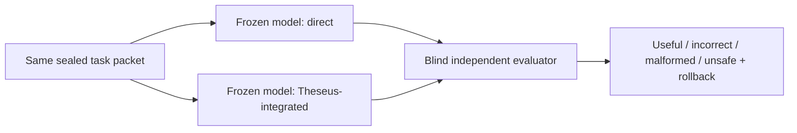

# Project Theseus: P3 Real-Task Evidence Brief

Status: review-ready, not published, and not claim-promoting.

## The result

On ten autonomously acquired, licensed Python maintenance tasks, the exact
frozen Qwen3.5 local model solved **1/10** tasks through direct generation and
**1/10** through the Theseus-integrated route. Integration increased parseable
typed edits from **5/10** to **9/10**, but it did not improve useful completion.
Twelve of fourteen independently evaluated edits were semantically wrong.

All fourteen evaluated candidates stayed inside authorized paths and passed
exact rollback. Unsafe outcomes and rollback failures were both zero.

## Matched outcome

| Measure | Direct | Theseus-integrated |
| --- | ---: | ---: |
| Tasks | 10 | 10 |
| Model calls | 19 | 17 |
| Parseable candidates | 5/10 | 9/10 |
| Correctness-evaluated candidates | 5 | 9 |
| Useful completions | 1/10 | 1/10 |
| Incorrect evaluated candidates | 4 | 8 |
| Malformed candidates | 5 | 1 |
| Unsafe candidates | 0 | 0 |
| Rollback-verified candidates | 5 | 9 |
| Model runtime | 623.9 s | 1,095.6 s |

The paired useful outcomes were one direct-only win, one integrated-only win,
and eight tasks solved by neither arm. The parseability discordance favored
integration on four tasks and direct on none, but the exact paired two-sided
p-value was 0.125. The 95% Wilson interval for each arm's 1/10 useful rate was
0.018–0.404.

## What this changes

P3 identifies the dominant next residual: semantic translation and repair after
an edit reaches the typed protocol. That prospectively selected
`cognitive-compilation-and-semantic-ir.core` for the first P4 causal
experiment. It also shows why parseability cannot stand in for usefulness: the
integrated route produced four more parseable edits while solving no more tasks.

The task pool, exact parent and target revisions, model identity, arm order,
candidate-visible context, evaluators, candidate reports, runtime receipts, and
terminal disposition are retained. All ten tasks are consumed. They may not be
replayed for fresh credit or used for training, D1, or D2.

## Critical limitation

This is the strongest completed real-task evidence in the repository, but it is
**historical bounded evidence, not current-charter capability proof**.

The frozen P3 decoder imposed a project-selected maximum of 1,536 generated
tokens per call. The retained receipts do not establish complete artifact,
model EOS, or another natural termination for every call. P3 predates the
current generation-boundary policy, which forbids a project-selected answer
length from becoming a competence or mechanism-failure boundary. The campaign
therefore cannot establish that the ceiling was causally irrelevant.

The maximum justified inference is narrow:

> For this exact frozen Qwen3.5 model, these ten licensed tasks, this typed-edit
> protocol, and this bounded decoder, direct and integrated each solved one
> task. Integration improved parseability but not useful completion.

This result does not support or falsify a Theseus subsystem, qualify serving,
open D1 or D2, rank the local model generally, or change an ASI Stack support
state.

## How the successor fixes the limitation

P4/P5 use complete-artifact or model-EOS termination, exact tokenizer-derived
context addressability, independent integrity recomputation, fresh
source-disjoint tasks, stronger causal controls, and no project-selected
quality-token cap. P4 must pass one final joined production
render→prompt→transport→parse→lower→apply→verify conformance release candidate,
then run once or be parked. A survivor may be qualified once on fresh D1
evidence; otherwise the exact scoped negative or inconclusive result is
retained.

The separately defined `gpt-5.6-luna` `xhigh` control has not run because no
governed callable transport is source-bound. If it becomes available, its
measurement-only denominator remains separate and its outputs cannot enter
serving, training, task selection, or local-model scoring.

## Evidence identity

- Terminal disposition:
  `reports/theseus_assistant_p3_terminal_disposition.json`
- Frozen instrument:
  `configs/theseus_assistant_p3_instrument.json`
- Sealed pool:
  `configs/theseus_p3_task_pool.json`
- Instrument freeze commit:
  `d08bf94653ee3a5ca508a2457ca21d58a4010a98`
- Task-pool seal commit:
  `1408abc829e3243f66f2b606b76aef514b11ab57`

No external publication or ASI Stack evidence-state transition is automatic
from this brief.
