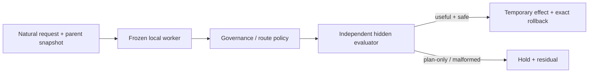
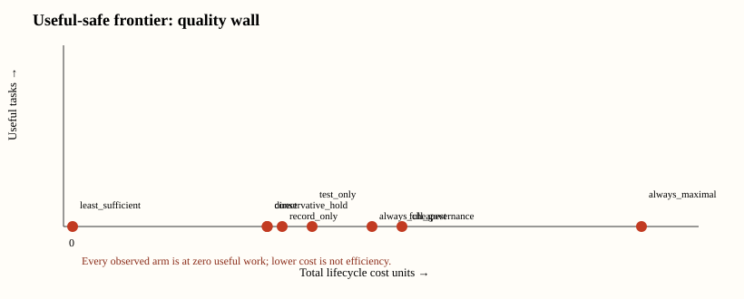

# Project Theseus: First Flagship Evidence Result

Historical status: this brief preserves the pre-P1 E2/E3 result. It has no
current scheduling or claim authority. P1 route integrity, P2C instrument
adequacy, P3 residual measurement, and P4 mechanics are now source-bound;
current state lives in `docs/PROJECT_STATE.md` and current execution order in
`roadmap.md`.

## The answer

The governance mechanics replayed cleanly; the worker frozen for this
historical packet could not do the work needed to test stack efficacy.

This is a useful negative result. Theseus reproduced one exact local
allowed/block/revoke/rollback packet from a clean archive, but its frozen
deterministic repository worker produced plans rather than patches. It completed
**0 of 3** development tasks. The preregistered rule therefore stopped E2 before
opening its four held-out tasks. On a separate six-task repeated-work cohort,
all **42** candidate variants remained target-blind and none completed a task.



## Matched results

| Experiment | Denominator | Useful | Result |
| --- | ---: | ---: | --- |
| Clean authority/effect replay | 1 packet | mechanics replayed | `POSITIVE_SCOPED` mechanics |
| E2 development competence | 3 tasks | 0 | `INCONCLUSIVE_WORKER_INADEQUATE` |
| E2 heldout | 4 tasks | unopened | preserved by frozen stop rule |
| E3 repeated work | 6 tasks / 42 variants | 0 | `INCONCLUSIVE_WORKER_INADEQUATE` |
| Existing-owner regressions | 9 controls | 9 passed | mechanics only |



The apparent safety of every E2/E3 arm is not a win: no candidate emitted an
effect-capable patch. Maximal routing consumed **114**
cost units, cheapest routing consumed **60**, and
least-sufficient routing held all six tasks because none met the frozen quality
predicate.

## What the evidence supports

- Exact local authority separation, observation, residual recording, and
  rollback mechanics are replayable for this packet.
- Candidate/evaluator separation held: E2 sealed 3 candidates and E3 sealed 42
  variants before opening their corresponding targets.
- The evidence process behaved correctly under failure: it retained zero-result
  denominators, did not lower the floor, did not open E2 heldout, and issued
  claim-scoped dispositions.

## What it does not support

It does not yet support governed-stack efficacy, planning utility, VCM utility,
procedural-reuse efficiency, least-sufficient routing, learned generation, or
student competence. This packet did not evaluate the 57M D2 candidate and did
not consume public calibration; there were zero external-inference or teacher
calls. A later independent maintenance audit recomputed both the current and
historical functional contracts, verified the historical packet's append-only
consumption, and found zero exact or normalized model-visible prompt overlap.
That freshness result is scoped to exact measurement-surface identity; it does
not evaluate D2, authorize its execution, or turn task-family reuse into a new
capability claim.

The 95% Wilson interval for the E2 useful rate is
**0.000–0.561**.
The denominator is deliberately shown because 0/3 is a wall, not a universal
falsification.

## Fastest meaningful next move

Do not replay this cohort, add another governance surface, or weaken the
evaluator. Continue the fresh source-disjoint P4S cognitive-compilation campaign
under its current frozen local model and completion policy. Run D1 once only if
the independent terminal disposition identifies a survivor; otherwise retain a
scoped negative and move to the independently sealed modular-versus-dense D2
experiment.

## Reproduce

```bash
python3 scripts/core_evidence_campaign.py --stage E2 --gate
python3 scripts/core_evidence_campaign.py --stage E3 --gate
python3 scripts/core_evidence_synthesis.py --gate
```

Evidence digests:

- E2: `d0dc3fde921435de00324bc8bb67ff9008a18805b736f6af94b3f266e07c5378`
- E3: `dd8a923f70e21c94a24b91d7429f9ed90b625e69db6767da950c9ad55c40cd77`
- E4: `7a59a90bb48ffc27bc99ec4eb8ffd76e739c28a9580a3e39b239d22dd3b88d87`

No ASI Stack book support state changes automatically from this brief.
