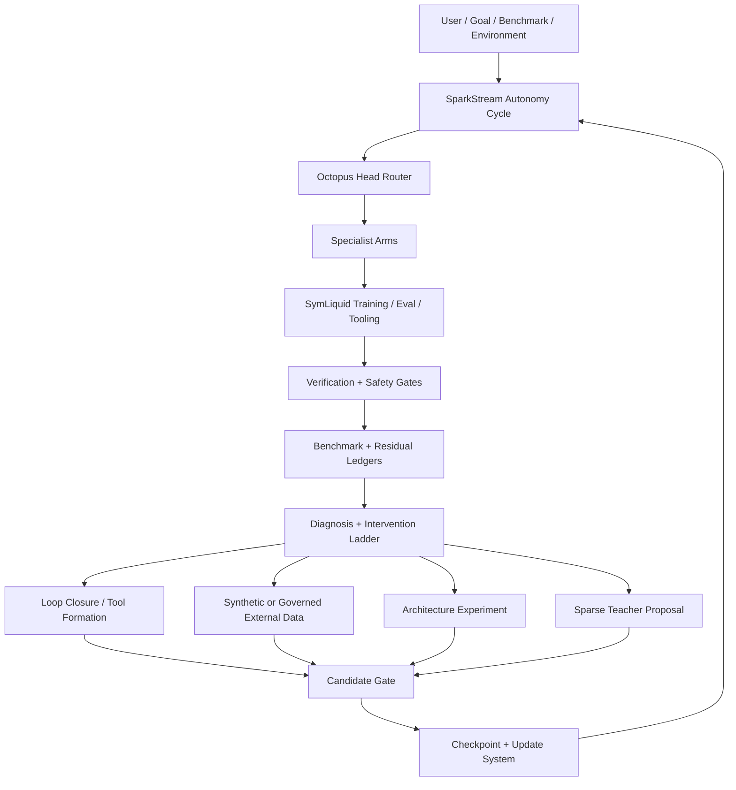

# Project Theseus

## A Ratcheting Modular Intelligence System Built From SymLiquid, SparkStream, Octopus Routing, and the Theseus Hive

Whitepaper  
Implementation-aligned draft v0.1  
Date: 2026-05-12  
Author: Corben Sorenson  
Status: Research architecture and local prototype

Current-state note: this whitepaper is a standalone architecture narrative, not
the live operations ledger. Before quoting scores, gates, Hive status, or next
actions, use `docs/PROJECT_STATE.md`, `docs/README.md`, and the generated
`reports/*.json` files. Historical snapshot bullets below are kept only when
they still describe the architecture; live numbers belong in Project State.

## TL;DR

Project Theseus is a local-first research system for building AI that improves
by turning pressure into structure. It combines a Rust-first cognitive substrate
called SymLiquid, an autonomous ratcheting control plane called SparkStream, a
system-level specialist router called the Octopus Router, and a distributed
personal-compute runtime called the Theseus Hive.

The system is not a foundation model and does not claim broad intelligence
today. It is an attempt to build the machinery required for durable
self-improvement:

- measure the current frontier;
- preserve mastered benchmarks as regression tests;
- escrow failures instead of forgetting them;
- generate governed synthetic and external data only through provenance,
  license, and leakage gates;
- route work through bounded specialist arms;
- compile repeated workflows into tools;
- use a sparse teacher only when local evidence shows a wall;
- make the smallest source or architecture change that clears the wall;
- checkpoint, verify, update, and continue.

The design law is:

```text
the frontier must move
the floor must hold
the system must stay small until evidence justifies growth
```

## Abstract

Modern AI projects often accumulate models, tools, benchmarks, dashboards,
scripts, memory stores, and safety policies without one unified growth loop.
Project Theseus organizes those pieces into a Ratcheting Modular Intelligence
system. A compact local model and software substrate attempts tasks; the
benchmark and residual ledgers expose what remains unsolved; the control plane
chooses interventions; successful repeated trajectories become tools; specialist
arms evolve under lifecycle governance; and accepted candidates become
checkpointed update surfaces.

At the root is SymLiquid, a compact generative substrate implemented in Rust. It
combines liquid continuous state, reservoir expansion, vector-symbolic memory,
KAN-lite transforms, active-inference-style scoring, and verifier-governed
readouts. Around it is SparkStream, an autonomous daemon and dashboard that
runs bounded training profiles, maintains ledgers, gates candidate promotion,
and calls a Codex teacher sparingly. The Octopus Router turns the system into a
set of bounded specialist arms with explicit schemas, local memories,
benchmarks, permissions, and residuals. The Theseus Hive extends the runtime
across trusted machines, advertising CUDA, MLX, CPU, and checkpoint-chat
capability through registered task kinds rather than arbitrary remote command
execution.

The current implementation is a research prototype. It is useful because it
makes the growth process inspectable: every benchmark, arm, source, tool,
checkpoint, teacher call, resource decision, and promotion gate has a report.
The long-term objective is autonomous capability growth, but the present system
keeps hard boundaries around external inference, licensing, data ingress,
teacher edits, remote work, and high-risk side effects.

## 1. Core Thesis

Project Theseus is based on the thesis that a capable AI system should not grow
as one opaque blob. It should grow as a measured, modular, self-auditing system
whose experiences are compressed into durable structure.

The growth pattern is:

```text
pressure
  -> attempt
  -> residual
  -> diagnosis
  -> compression
  -> verification
  -> structure
  -> new pressure
```

The pressure can be a benchmark, a user task, an RL environment, a code issue,
a game, a robotics task, a context-length failure, or a tool-use bottleneck.
The structure can be a memory, a tool, a benchmark adapter, a specialist arm, a
policy, a checkpoint, a source patch, or an architecture change.

The important point is that improvement should be diagnosed before it is
implemented. More parameters, more tools, more data, and more architecture are
not automatically progress. They are interventions that should be justified by
residual evidence.

## 2. Non-Claims

This project does not currently claim:

- to be a foundation model;
- to be generally intelligent;
- to be production safe;
- to train at frontier scale on a single RTX 2060 Super;
- to eliminate the need for human judgment;
- to make teacher assistance unnecessary today;
- to make public benchmark scores equal real-world capability;
- to make self-editing safe without gates;
- to make public compute markets legally or technically ready.

The current claim is narrower and more testable:

Project Theseus implements a local, report-driven architecture for ratcheting a
small AI system through benchmark pressure, residual escrow, modular routing,
governed data ingress, sparse teacher bootstrapping, and checkpointed
self-improvement.

## 3. System Overview

Project Theseus has five main layers.

| Layer | Purpose |
| --- | --- |
| SymLiquid substrate | Rust-first compact model primitives and local training/eval paths. |
| SparkStream control plane | Dashboard, daemon, autonomy cycle, reports, goals, checkpoints, and launch readiness. |
| Octopus Router | Head/router plus governed specialist arms with memory, permissions, benchmarks, and lifecycle state. |
| Ratchet ledgers | Benchmark ledger, residual escrow, tool registry, model/checkpoint ledger, source registry, and capability matrix. |
| Theseus Hive | Installable personal compute mesh for trusted Windows/macOS/Linux/phone clients, CUDA/MLX worker chunks, and checkpoint chat routing. |

The high-level loop is:



## 4. SymLiquid: The Substrate

SymLiquid is the local cognitive substrate at the center of the project. It is
implemented in Rust and designed to be inspectable, small, and benchmarkable.

The core dataflow is:

```text
observation
  -> KAN-lite encoder
  -> liquid continuous-state cell
  -> reservoir expansion
  -> vector-symbolic memory
  -> belief / expected-free-energy scoring
  -> readout or action
```

The substrate is framed as a Compact Generative System:

```text
C = (S, R, M, epsilon, V, G)
```

| Term | Meaning in Project Theseus |
| --- | --- |
| `S` | Seed state or compact core. |
| `R` | Rules, kernels, transitions, or learned readouts. |
| `M` | Liquid, reservoir, VSA, checkpoint, or arm-local memory. |
| `epsilon` | Residual error, uncertainty, failed retrieval, or benchmark failure. |
| `V` | Verification reports, gates, tests, and safety checks. |
| `G` | Governance interface: action selection, routing, policy, or update control. |

The main Rust components are:

| Component | Role |
| --- | --- |
| Liquid state | Streaming temporal context. |
| Reservoir expansion | Cheap nonlinear temporal basis. |
| VSA memory | Explicit compositional role-filler binding and retrieval. |
| KAN-lite transforms | Inspectable nonlinear compression/readout. |
| FEP-style scoring | Active information seeking and action selection. |
| CGS accounting | Cost, residual, verification, and leverage diagnostics. |

The training path currently includes CPU reference runs, Rust/CUDA readout
training, Rust/CUDA rollout training, residual-adapter probes, and small
governance benchmarks. Python is used for orchestration and reporting; hot loops
are intended to stay in Rust/CUDA on Windows/NVIDIA and MLX on Apple Silicon.

## 5. SparkStream: The Autonomy Control Plane

SparkStream is the always-on local control plane. It provides:

- a dashboard at `http://127.0.0.1:8787`;
- a daemon for repeated autonomy cycles;
- one-shot and long-running profile runners;
- report refresh and observability;
- autonomous goal routing;
- sparse teacher escalation;
- candidate promotion gates;
- checkpoint registry;
- source and benchmark discovery;
- synthetic data curation;
- resource governance;
- capability matrix updates.

The main entrypoint is:

```powershell
powershell -ExecutionPolicy Bypass -File scripts\start_sparkstream.ps1 `
  -StartDaemon -Profile inner_loop -Execute -AllowTeacher -AllowNetworkFetch `
  -DurationHours 10 -Port 8787
```

An autonomy cycle:

1. audits external inference boundaries;
2. refreshes license and resource status;
3. refreshes benchmark, source, data, RL, and adapter registries;
4. refreshes the Octopus arms and routing traces;
5. runs or queues the selected profile;
6. updates benchmark and residual ledgers;
7. refreshes context packets and capability matrix;
8. decides whether teacher guidance is justified;
9. writes a compact self-improvement queue.

SparkStream is not merely a dashboard. It is the operating loop that makes RMI
measurable.

## 6. Octopus Router And Specialist Arms

The Octopus Router is a system-level router. Its job is not to solve every
domain itself. Its job is to route tasks to bounded specialist arms, grant
scoped permissions, compose results, and preserve global coherence.

The current arm registry contains arms such as:

- `head_router`;
- `benchmark_ratchet_arm`;
- `babylm_grammar_arm`;
- `bridge_benchmark_arm`;
- `residual_governance_arm`;
- `puffer_ocean_control_arm`;
- `puffer_ocean_logging_arm`;
- `adversarial_rag_arm`;
- `rust_cuda_systems_arm`;
- `loop_closure_tool_arm`;
- `public_calibration_arm`;
- `safety_reflex_arm`.

Each arm has:

- capability scope;
- input and output schemas;
- local tools;
- local memory;
- permission boundary;
- runtime tier;
- benchmark frontier;
- regression suite;
- residual escrow;
- reliability score;
- lifecycle status;
- retirement criteria.

The router uses a deterministic rule layer plus a small local learned router
head trained on routing traces. Real dashboard and daemon routes append to
`reports/routing_memory_real_traces.jsonl`, so the router can gradually move
from synthetic cases toward actual project behavior.

Arm lifecycle governance prevents modularity from becoming hidden monoliths. It
can recommend:

- spawn a new arm when recurring pressure needs a specialist;
- split an arm when it becomes too broad;
- merge arms when overlap exceeds value;
- deprecate or retire arms when stale, unsafe, unused, or superseded.

## 7. Benchmark Ratcheting

Project Theseus treats benchmarks as pressure surfaces, not sacred final
definitions of intelligence.

Benchmarks move through statuses:

| Status | Meaning |
| --- | --- |
| Frontier | Current unsaturated pressure. |
| Diagnostic | Explains a failure mode. |
| Regression | Preserves mastered capability. |
| Public calibration | Allows apples-to-apples comparison. |
| Retired | Too stale, contaminated, noisy, or uninformative. |

The core rule is:

```text
advance at mastery
preserve the tail
promote recurring residuals
```

The candidate gate requires frontier improvement while preserving regression
floors. A candidate should not promote simply because one score went up. It
must preserve architecture gates, RMI score, public comparators, prior mutated
holdouts, residual escrow health, and runtime/cost reporting.

Older drafts listed a one-time gate count here. That count is now historical
and should not be copied forward. The current gate story is simpler:

- autonomous training and teacher proposal mode can run when resource and
  launch-readiness gates allow them;
- candidate promotion remains blocked while broad public code transfer is below
  floor;
- candidate evidence must stay clean: learned token-level generation,
  full-body candidates, no public-solution training, no template/wrapper
  shortcut, no loop-closure benchmark solving, and no external inference.

These numbers are implementation state, not claims of broad capability. The
machine-readable source of truth remains `reports/*.json`, with
`docs/PROJECT_STATE.md` as the human-readable summary.

## 8. Residual Escrow

Residual escrow is the mechanism that prevents tail erasure.

When the system advances, unsolved cases do not vanish. They are tracked,
clustered, periodically reattempted, and promoted when they recur across
benchmarks or profiles.

Residuals can identify several wall types:

- data wall;
- training wall;
- inference or search wall;
- benchmark defect;
- tool or adapter wall;
- architecture wall;
- safety or permission wall;
- resource or performance wall.

This distinction matters because each wall should trigger a different
intervention. The system should not change architecture when the problem is bad
labels, stale data, missing adapter code, or an underpowered profile.

## 9. Cognitive Loop Closure

Project Theseus should not repeat the same reasoning workflow forever. When a
trajectory succeeds repeatedly, the loop-closure machinery asks whether it
should become a verified tool.

The pipeline is:

```text
trajectory logs
  -> loop detection
  -> abstraction
  -> parameter discovery
  -> tool synthesis
  -> verification
  -> registration
  -> routing
  -> monitoring
  -> revision or retirement
```

Candidate tools are not automatically trusted. Each receives:

- parameters;
- preconditions;
- postconditions;
- verification plan;
- runtime tier;
- risk tier;
- failure modes;
- retirement criteria.

This is how successful teacher repairs, benchmark ingestion workflows,
training preflights, source audits, and residual analyses can eventually become
local procedural memory.

## 10. Synthetic And External Data Governance

The project is designed to learn from more than hand-authored fixtures, but it
does not treat the internet as free training material.

Data ingress is governed by:

- source registry;
- license and terms metadata;
- provenance;
- leakage checks;
- split checks;
- sample caps;
- synthetic ratio caps;
- public/private comparator separation;
- ignored local artifact storage.

The synthetic data curator creates residual-targeted local examples and blends
them at a low ratio. The point is not to flood the model with self-generated
text. The point is to create signal-rich bridge data for known residual
families, then verify that public and private comparator performance does not
collapse.

External samples are allowed only through governed tiny sampling when policy
permits it. Bulk downloads, uncertain licenses, and training on private or
commercial assets are blocked by default.

Local game and ROM assets are treated as user-supplied private resources. The
system can inventory and build benchmark cards around them, but it must not
autonomously fetch commercial ROMs.

## 11. Context Packet Memory

Long-horizon autonomy produces too much raw output to keep everything active.
Project Theseus uses scored context packets.

Each packet has:

- type;
- source path;
- title and compact text;
- metadata;
- deterministic importance score.

The scorer favors:

- conclusions earned after many tests;
- frontier, residual, blocker, safety, teacher, and promotion-gate facts;
- recent verified outcomes;
- compact summaries over raw output.

When context is tight, the system drops low-value packets, merges high-value
related packets into summaries, and reranks the active set. This is a practical
memory mechanism for week-scale autonomy: keep the earned knowledge, not the
noisiest logs.

## 12. Sparse Teacher Bootstrapping

The teacher is currently Codex CLI with GPT-5.5 configured through policy. It is
not supposed to be the system's everyday intelligence. Its role is to bootstrap
the local system when measured evidence shows a real wall.

Teacher use is:

- sparse;
- budgeted;
- proposal-first;
- forbidden inside worker chunks;
- forbidden inside the OpenAI-compatible local endpoint;
- audited by `external_inference_calls`;
- allowed to edit source only through guarded self-evolution.

The guarded self-edit lane is:

```text
local evidence
  -> self-evolution governor says teacher apply is allowed
  -> clean worktree
  -> branch creation
  -> teacher patch
  -> local checks
  -> benchmark/regression gates
  -> commit or leave branch for review
```

Teacher traces are saved so repeated repairs can eventually become local
loop-closure tools. The long-term goal is to reduce teacher dependence by
distilling its successful repair patterns into the local system.

## 13. Self-Evolution Governance

Self-evolution is not uncontrolled self-modification. It is a branch-and-gate
engineering lane.

The intervention ladder is:

1. audit the benchmark;
2. improve data;
3. improve training;
4. improve inference, retrieval, routing, or tools;
5. close repeated loops into verified tools;
6. add bridge benchmarks;
7. make the smallest architecture change;
8. add parameters only when evidence requires it.

The self-evolution system includes:

- `self_evolution_governor.py`;
- `teacher_self_edit_runner.py`;
- `benchmark_adapter_factory.py`;
- `architecture_experiment_governor.py`;
- `autoresearch_gap_audit.py`;
- `loop_closure_harvester.py`;
- `attd_analyzer.py`.

ATTD, or Assembly-Theoretic Technical Debt, acts as a deterministic repo-health
gate. It flags when source structure is becoming too costly to maintain and can
trigger teacher cleanup before the system continues to proliferate adapters or
architecture.

## 14. Checkpoints And Updates

Project Theseus uses a major/minor checkpoint idea inspired by the Ship of
Theseus: the system can keep evolving while preserving a traceable identity.

Major checkpoints contain a fuller state. Minor checkpoints can build as
transforms or deltas from prior versions. This keeps long-running progress more
compact than copying everything every time.

The checkpoint system tracks:

- report state;
- model artifacts within policy limits;
- manifests;
- parent/child relationships;
- materialization paths;
- comparison reports;
- accepted-candidate backup status.

Accepted candidates can produce update offers:

- soft updates: activate checkpoint metadata without a restart;
- hard updates: staged app/source changes with restart and protection gates.

Protected local arms, company arms, local configs, reports, checkpoints, data,
and ROM assets are not overwritten by ordinary updates.

## 15. Performance And Resource Awareness

Speed is treated as a core capability. Faster training and inference give the
local learner more effective lifetime.

The current policy is:

- Rust/CUDA owns Windows/NVIDIA hot loops;
- MLX owns Apple Silicon worker chunks;
- Python orchestrates and reports;
- CPU is fallback and glue;
- the resource governor decides whether a profile can run;
- the performance optimizer chooses the fastest safe backend from evidence.

The performance optimizer reads:

- resource governor;
- Hive scheduler;
- CUDA reports;
- MLX worker chunks;
- worker-chunk ledger;
- training profile reports.

It writes:

- `reports/performance_optimizer.json`;
- `reports/performance_optimizer.md`.

At the time this draft was written, the local performance optimizer reported
GREEN, score 1.0, Rust/CUDA as preferred training and inference backend, and
real CUDA worker chunks planned by the Hive scheduler. MLX support is present
in the worker layer but must be verified on Apple Silicon hardware.

## 16. Theseus Hive

The Theseus Hive is the installable personal-compute mesh. Its purpose is to
let trusted machines on a home, workshop, friend/family, or company network
contribute compute and expose checkpoint chat without giving remote nodes
arbitrary control.

Supported directions:

- Windows app/launcher;
- macOS launcher and MLX worker support;
- Linux/server CLI;
- phone/PWA operator client;
- LAN discovery;
- invite-gated relay or private tunnel for cross-network setups;
- Hive profile switching;
- local OpenAI-compatible endpoint per device.

The Hive advertises:

- CPU;
- memory;
- disk;
- NVIDIA/CUDA;
- Apple MLX;
- Rust build capability;
- checkpoint chat gateway;
- update client;
- internal compute-market accounting.

Remote work is constrained to registered task kinds such as:

- `resource_probe`;
- `capability_refresh`;
- `readiness_check`;
- `checkpoint_chat`;
- `cuda_eval_chunk`;
- `cuda_training_chunk`;
- `cuda_rollout_chunk`;
- `mlx_eval_chunk`;
- `mlx_training_chunk`;
- `mlx_rollout_chunk`;
- `update_status`;
- `update_apply_soft`.

The Hive explicitly forbids remote arbitrary shell, teacher calls, git pushes,
ROM imports, bulk downloads, and hard source updates.

## 17. Compute Market And Licensing

The compute-market layer is currently internal accounting, not a public
cryptocurrency release.

It provides:

- gas estimates for bounded Hive work;
- work receipts;
- duplicate rejection;
- provider payout accounting;
- local Theseus Work Credit ledger.

Public token issuance, exchange, custody, fiat rails, and public-chain bridging
are disabled until a separate reviewed release.

The licensing system gates:

- local registration;
- free homelab/community use;
- private Hive;
- friends/family Hive;
- distributed worker chunks;
- company Hive;
- public gateway operation;
- update install rights.

The intended ethical business posture is:

- free for personal and small non-commercial/community use under capped seats;
- paid licenses for larger organizations and company/private update channels;
- private compute and secrets remain private;
- public contribution is opt-in and bounded.

## 18. Safety And Quarantine

Project Theseus uses explicit safety boundaries because autonomy without
boundaries becomes an unbounded automation risk.

Safety mechanisms include:

- permission envelopes for arms;
- runtime tiers;
- risk tiers;
- safety/reflex arm for high-risk routes;
- external inference audit;
- teacher budget/cooldown;
- license gates;
- data provenance gates;
- network fetch gates;
- resource governor;
- candidate promotion gate;
- launch readiness gate;
- remote task allowlist;
- human approval for high-risk side effects.

The current safety layer is research governance, not certified runtime
verification for physical safety, medical, legal, financial, or security-critical
deployment. A robot or drone control lane would require stricter real-time
failsafes, sandboxing, telemetry, and domain certification before use outside
simulation or controlled experiments.

## 19. Observability

Project Theseus is report-first. Important state is stored as machine-readable
JSON/JSONL, not only dashboard text.

Key reports include:

| Report | Role |
| --- | --- |
| `reports/sparkstream_status.json` | Live daemon phase and next cycle. |
| `reports/autonomy_cycle_last.json` | Last full autonomy cycle. |
| `reports/autonomy_launch_readiness.json` | Press-play readiness. |
| `reports/performance_optimizer.json` | CUDA/MLX/Hive bottleneck and backend choice. |
| `reports/resource_governor.json` | GPU, VRAM, disk, and profile decision. |
| `reports/benchmark_ledger.json` | Frontier/regression benchmark lifecycle. |
| `reports/residual_escrow.json` | Active residual clusters and cases. |
| `reports/arm_registry.json` | Specialist arms. |
| `reports/arm_lifecycle_governance.json` | Add/split/merge/deprecate proposals. |
| `reports/tool_registry.json` | Verified tool registry. |
| `reports/checkpoint_registry.json` | Major/minor checkpoint chain. |
| `reports/hive_status.json` | Local Hive node resources and capabilities. |
| `reports/hive_scheduler.json` | Worker placement plan. |
| `reports/capability_matrix.json` | Feature maturity and market comparison. |

The dashboard is the human control surface. The reports are the contract.

## 20. Current Implementation Snapshot

As of the current consolidated docs, the local reports describe the system as:

- autonomous training and long-unattended supervision are available through
  SparkStream plus Vacation Mode Supervisor V2;
- VIEA is the canonical control spine, with runnable command contracts,
  SQLite artifact-kernel reports, feedback actions, and a bounded action
  executor;
- candidate promotion is blocked until broad public code transfer clears the
  floor with clean token-level student evidence;
- broad public code calibration is YELLOW, not a tiny-slice win: 130 public
  calibration tasks across HumanEval, MBPP, EvalPlus, BigCodeBench, and
  LiveCodeBench at `0.476923` aggregate pass rate, with only HumanEval above
  floor;
- Rust/CUDA remains the Windows hot path, while MLX-capable Macs are expected
  to join through the Hive training-link/worker-chunk path;
- Hive now covers setup wizard, CLI, LAN/private relay, any-node operator
  control, remote-control handoffs, storage shares, mobile/PWA/native shells,
  version convergence, always-busy utilization sweeps, and reviewed rented
  compute/storage planning;
- free homelab registration remains the ordinary private-Hive path, while
  company/public gateway modes are gated by signed license;
- external inference remains limited to the sparse teacher surface and must not
  become benchmark answers, public-task distillation, or promotion evidence.

This snapshot should be treated as ephemeral. Before making public claims or
starting serious training, refresh the reports.

## 21. Failure Modes

The architecture explicitly tracks failure modes:

| Failure mode | Mitigation |
| --- | --- |
| Benchmark gaming | Private/generated frontiers, public calibration separation, residual narratives. |
| Tail obsession | Mastery thresholds, residual escrow, frontier rotation. |
| Tail erasure | Escrow, reattempt schedules, recurrence promotion. |
| Tool bloat | Tool acceptance rule, usage metrics, retirement. |
| Arm bloat | ATTD, lifecycle governance, split proposals. |
| Bad routing | Router benchmarks, safety arm, fallback routing, real traces. |
| Under-quarantine | Permission envelopes and audit logs. |
| Over-quarantine | Controlled grants and escalation policy. |
| Architecture churn | Intervention ladder and experiment ledger. |
| Teacher dependence | Sparse use, trace distillation, loop closure. |
| Compute ceiling | Efficient Rust/CUDA/MLX paths and future Hive expansion. |
| Unsafe public compute | Registered task kinds, secrets, licensing, sandbox plan, public gateway disabled. |

## 22. Roadmap

Near-term priorities:

1. Keep the VIEA/Vacation Mode autonomy loop stable for long unattended runs.
2. Close broad semantic code transfer honestly: MBPP, EvalPlus,
   BigCodeBench, and LiveCodeBench need clean 32+ task evidence above floor,
   with STS-on beating STS-off per card.
3. Make private repo repair the main curriculum after function-completion
   smoke runs: repo snapshot -> patch -> tests -> residual -> repair trace ->
   learner row -> private eval -> public calibration.
4. Strengthen the SymLiquid/state decoder on source-agnostic transferable
   concepts such as type/return-shape, admissibility/interface, and edge
   conditions rather than benchmark-name patches.
5. Verify and use MLX worker chunks on Mac while keeping Windows CUDA chunks
   strong and Linux/server nodes easy to enroll.
6. Turn repeated benchmark ingestion, residual analysis, repair traces, and
   operator flows into measured tools that can expire when they stop helping.
7. Expand benchmark adapters for staged RL, coding, web, repo repair, desktop,
   and game environments without violating data/licensing boundaries.
8. Keep Hive packaging, self-update, utilization, remote access, and rented
   compute polished enough that spare trusted compute can join and stay aligned.

Medium-term priorities:

1. Make benchmark adapter generation more automatic.
2. Make architecture experiments fully closed-loop.
3. Improve local codebase-engineering capability so teacher help becomes less
   frequent.
4. Add distributed optimizer/state synchronization after bounded worker chunks
   are reliable.
5. Package the Hive as a polished app on Windows, macOS, Linux, iOS, and
   Android/PWA.
6. Build stronger checkpoint chat and live model interaction surfaces.

Long-term research direction:

1. A small model that learns many tasks through benchmark pressure and tool
   closure.
2. A personal Hive that can route training and inference to the best trusted
   device.
3. A public contribution path that is legal, signed, sandboxed, and useful.
4. A local system that uses the teacher less over time because it has learned
   the repair, benchmark, and architecture patterns itself.

## 23. Conclusion

Project Theseus is an attempt to build an AI system that can keep becoming
itself while replacing parts of itself. SymLiquid is the compact substrate.
SparkStream is the ratcheting loop. The Octopus Router gives it governed
specialists. The ledgers make progress and failure visible. The teacher helps
only when the local system reaches a measured wall. The Hive lets the system
grow across trusted machines. Checkpoints and updates preserve continuity.

The project is early. It is narrow. It is bounded. But it has the right shape
for open-ended local improvement: pressure, residuals, structure, verification,
and another turn of the ratchet.

## Appendix A: Core Commands

Start the dashboard and daemon:

```powershell
powershell -ExecutionPolicy Bypass -File scripts\start_sparkstream.ps1 `
  -StartDaemon -Profile inner_loop -Execute -AllowTeacher -AllowNetworkFetch `
  -DurationHours 10 -Port 8787
```

Start the Hive node:

```powershell
powershell -ExecutionPolicy Bypass -File scripts\start_theseus_hive.ps1
```

Refresh readiness:

```powershell
python scripts\autonomy_launch_readiness.py --out reports\autonomy_launch_readiness.json
```

Refresh performance:

```powershell
python scripts\performance_optimizer.py `
  --policy configs\performance_policy.json `
  --out reports\performance_optimizer.json `
  --markdown-out reports\performance_optimizer.md
```

Run one autonomy cycle:

```powershell
python scripts\autonomy_cycle.py --profile smoke --allow-teacher --allow-network-fetch
```

Plan Hive worker chunks:

```powershell
python scripts\hive_scheduler.py --policy configs\hive_policy.json --out reports\hive_scheduler.json --worker-chunks
```

## Appendix B: Source Documents

Start with:

- `docs/PROJECT_STATE.md`;
- `docs/TOP_TO_BOTTOM_ARCHITECTURE.md`;
- `docs/SPARKSTREAM_AUTONOMY.md`;
- `docs/OCTOPUS_ROUTER.md`;
- `docs/RATCHETING_MODULAR_INTELLIGENCE.md`;
- `docs/SELF_EVOLUTION_SYSTEM.md`;
- `docs/THESEUS_HIVE.md`;
- `docs/TRAINING_EVALS_BENCHMARKS.md`;
- `docs/CAPABILITY_MATRIX.md`;
- `docs/DATA_AND_ARTIFACTS.md`.

Machine-readable truth lives in `reports/*.json` and `reports/*.jsonl`.
