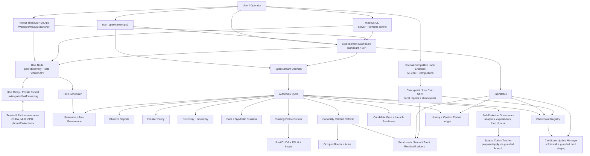

# Top-To-Bottom System Architecture

Last reviewed: 2026-05-20.

This document describes the current local SymLiquid / SparkStream / RMI system as it exists in the repository. It is the operational architecture, not just the conceptual whitepaper architecture.

## 1. System In One Sentence

SymLiquid is a Rust-first cognitive substrate wrapped by SparkStream, a local Ratcheting Modular Intelligence control plane organized under Verified Intent-to-Execution Architecture (VIEA). It observes benchmark pressure, routes work through Octopus specialist arms, runs bounded training profiles, records residuals, curates synthetic and governed external data, checkpoints state, compiles raw intent into artifact-backed worlds through the Reality Manipulator MVP, and asks a sparse Codex teacher for proposal-oriented guidance or guarded branch-and-gate source edits when local evidence says it is stuck.

## 2. Current Runtime Snapshot

At the time of this review:

| Area | Current state |
| --- | --- |
| Dashboard | `http://127.0.0.1:8787` responds through `scripts/sparkstream_dashboard.py`. |
| OpenAI-compatible local endpoint | Toggleable per device; default base URL is `http://127.0.0.1:8789/v1`, routed to local checkpoint/live chat. |
| Daemon | `scripts/sparkstream_daemon.py` is active on the `inner_loop` schedule. |
| Latest profile activity | The daemon is current; the watchdog should only go RED for a real operational blocker, stale promotion-facing governance report, or honest learning wall. Teacher architecture calls are proposal-only and no longer budget-starved for allowed wall-diagnosis reasons. |
| Latest frontier decision | code-family pressure remains the promotion wall; `reports/transfer_generalization_audit.json` currently points at shared type/return-shape, edge-condition, admissibility/interface, and BigCodeBench-heavy algorithmic-planning residuals rather than one benchmark identity. |
| Latest frontier report | `reports/real_code_benchmark_graduation.json` for the active card plus `reports/broad_transfer_matrix.json` for broad truth. |
| Candidate promotion | Blocked by current gate: `promote=false`; failed gate family is broad public code transfer, and public score semantics remain calibration-only. |
| Broad transfer matrix | `YELLOW`: 160 public calibration tasks, aggregate pass rate `0.5125`, broad STS delta `0.28125`, no no-cheat violations, HumanEval and MBPP above floor, and EvalPlus/BigCodeBench/LiveCodeBench below floor. |
| VIEA action path | `scripts/viea_autonomy_spine.py`, `scripts/viea_action_executor.py`, and `scripts/vacation_mode_supervisor.py` run command contracts through artifact kernel writes, runtime packets, verification, feedback actions, and unattended progress checks. |
| Overnight readiness | `overnight_launch_ready=true` with `YELLOW` readiness; promotion remains blocked until public transfer clears the floor. |
| License status | Local install registered as `homelab_free`; worker chunks and teacher bootstrap allowed; company/public gateway blocked until signed paid license. |
| Candidate updates | `scripts/update_manager.py` ties accepted candidates to soft/hard update offers; soft installs activate checkpoint metadata, hard app/source installs are staged and restart-gated. |
| Compute market | `scripts/compute_market.py` quotes internal gas for bounded Hive work, settles accepted worker receipts into local TWC accounting, and keeps public token/exchange mode disabled. |
| Rented compute/storage | `scripts/hive_rented_compute.py` plans and, after explicit execution, launches/stops reviewed AWS/GCP/Azure/RunPod/Vast compute or AWS/GCP/Azure object storage under local budget and time-window policy; `scripts/hive_rented_compute_profiles.py` owns provider aliases/defaults/catalog normalization. |
| Hive utilization | `scripts/hive_utilization_manager.py` keeps safe idle private CPU/CUDA/MLX slots fed with user work first, bounded training, CPU self-improvement/maintenance, and grounded checkpointing; it now uses the unified node registry plus longer inner-loop accelerator leases to avoid bursty per-cycle work and is also called by Vacation Mode Supervisor. |
| Resource governor | Green for requested profile; execution owner is `rust_cuda`; recommended fallback profile is `smoke`. |
| Personality runtime | `reports/personality_runtime_audit.json` is `GREEN`; checkpoint chat attaches active personality context. |
| Arm lifecycle | governed arms and routing traces remain dashboard-visible; see `reports/arm_lifecycle_governance.json`. |
| Training-data sampler | 96 governed open-license sample rows, 512 derived pairwise rows, 0 errors. |
| RL registry | 58 local envs, 252 discovered candidates, 147 open-license candidates, 8 staged imports. |
| Context packet ledger | 109 packets total, 96 active, 5 summary packets, 13 drop candidates. |

Runtime note: use `scripts/start_sparkstream.ps1 -Restart` before unattended
long runs or candidate-profile launches. That restart path collapses stale
dashboard, daemon, and profile-runner processes before starting the current
code.

Decoder note: `scripts/code_lm_closure.py` now feeds governed high-transfer
private rows into Code LM closure by default and records per-file counts.
`crates/symliquid-cli` runs the CLI and heavy learner subcommands on a larger
Windows stack, then Decoder V2 plans return shape, admissible interfaces,
semantic skeletons, branch/loop/local structure, and STS/SymLiquid hints before
token decoding. The latest bounded verification loaded 3,697 high-transfer
rows and improved a 20-task private probe from `0.0` to `0.70`, but public code
promotion remains blocked until broad receiver-card transfer clears honestly.

## 3. Layered Architecture



The system has three large planes:

| Plane | Job | Main files |
| --- | --- | --- |
| Control plane | Starts, schedules, routes, gates, and observes work. | `scripts/start_sparkstream.ps1`, `scripts/start_theseus_hive.ps1`, `scripts/theseus_cli.py`, `scripts/sparkstream_dashboard.py`, `scripts/openai_compat_server.py`, `scripts/sparkstream_daemon.py`, `scripts/autonomy_cycle.py`, `scripts/viea_autonomy_spine.py`, `scripts/viea_action_executor.py`, `scripts/vacation_mode_supervisor.py` |
| Intelligence plane | Benchmarks, trains, evaluates, routes arms, and updates capability structure. | `scripts/run_training_ratchet_profile.py`, `scripts/run_capability_ratchet.py`, `scripts/octopus_router.py`, `crates/*` |
| Governance plane | Keeps work bounded by resources, licenses, safety, teacher budget, promotion gates, checkpoints, and repo-health debt pressure. | `configs/autonomy_policy.json`, `configs/license_policy.json`, `configs/attd_policy.json`, `scripts/license_manager.py`, `scripts/resource_governor.py`, `scripts/attd_analyzer.py`, `scripts/candidate_promotion_gate.py`, `scripts/arm_lifecycle_manager.py`, `scripts/checkpoint_registry.py` |
| Hive plane | Discovers trusted peers, advertises CUDA/MLX/CPU capacity, routes weak-client chat, safe reports, bounded real CUDA/MLX worker chunks, accepted-candidate soft updates, always-busy utilization sweeps, per-user operator access, audited remote-control handoffs, storage shares, room-aware voice routing, mobile operator surfaces, quote-first rented compute/storage, invite-gated relay/private-tunnel crossing, and native app packaging. | `configs/hive_policy.json`, `configs/compute_market_policy.json`, `scripts/theseus_cli.py`, `scripts/hive_node.py`, `scripts/hive_users.py`, `scripts/hive_worker_chunk.py`, `scripts/hive_relay.py`, `scripts/hive_invite.py`, `scripts/hive_scheduler.py`, `scripts/hive_utilization_manager.py`, `scripts/hive_rented_compute.py`, `scripts/hive_rented_compute_profiles.py`, `scripts/hive_remote_control.py`, `scripts/hive_storage.py`, `scripts/hive_voice_following.py`, `scripts/compute_market.py`, `scripts/start_theseus_hive.*`, `reports/hive_*.json`, `reports/compute_market_*.json` |

## 4. Operator And Dashboard Layer

The entrypoint is:

```powershell
.\scripts\start_sparkstream.ps1 -StartDaemon -Profile inner_loop -Execute -AllowTeacher -AllowNetworkFetch -DurationHours 10 -Port 8787
```

`scripts/start_sparkstream.ps1`:

| Responsibility | Detail |
| --- | --- |
| Python selection | Prefers `.venv-puffer\Scripts\python.exe`, then falls back to `python` or `py`. |
| Dashboard launch | Starts `scripts/sparkstream_dashboard.py` on `127.0.0.1:$Port`. |
| Daemon launch | Starts `scripts/sparkstream_daemon.py` when `-StartDaemon` is set. |
| Restart cleanup | With `-Restart`, stops existing dashboard/daemon processes matching command-line patterns and frees the port. |
| Hidden windows | Uses hidden PowerShell process windows for background operation. |

`scripts/sparkstream_dashboard.py` is a standard-library HTTP server. It serves:

| Endpoint | Purpose |
| --- | --- |
| `GET /` | Dashboard UI from `dashboard/index.html`. |
| `GET /api/status` | Full live status bundle from reports and job state. |
| `GET /api/events` | Server-sent events stream, refreshed every 2 seconds. |
| `POST /api/control` | Run a cycle, start/stop/pause/resume daemon, or run a profile. |
| `POST /api/license/status` | Refresh local registration/license status. |
| `POST /api/license/register` | Register this install for free community/private-Hive use after terms acceptance. |
| `POST /api/license/request` | Write an ignored paid-license request bundle. |
| `POST /api/license/import` | Import a signed paid license JSON payload. |
| `POST /api/openai/status` | Refresh local OpenAI-compatible endpoint status. |
| `POST /api/openai/configure` | Configure the endpoint host, port, model, checkpoint, and token mode. |
| `POST /api/openai/start` | Enable and start the loopback OpenAI-compatible endpoint. |
| `POST /api/openai/stop` | Stop the local OpenAI-compatible endpoint. |
| `POST /api/readiness/run` | Refresh arm lifecycle governance and launch readiness. |
| `POST /api/checkpoints/create` | Create major/minor/auto checkpoint. |
| `POST /api/checkpoints/compare` | Compare two checkpoints. |
| `POST /api/checkpoints/materialize` | Rebuild a checkpoint state into `checkpoints/materialized/...`. |
| `POST /api/checkpoints/backup` | Run accepted-candidate-only GitHub/Drive backup policy. |
| `POST /api/benchmarks/add` | Queue or fetch a benchmark URL with explicit confirmation. |
| `POST /api/benchmarks/discover` | Network benchmark discovery with explicit confirmation. |
| `POST /api/teacher/ask` | Queue or call the sparse teacher. |
| `POST /api/chat/checkpoint` | Ask the live or materialized checkpoint interface. |
| `POST /api/goals/run` | Route a natural-language goal through the autonomous goal runner. |
| `POST /api/rl/discover` | Discover RL sources through the license-gated RL registry. |
| `POST /api/sources/catalog` | Refresh/import online source catalog entries. |
| `POST /api/hive/probe` | Refresh local Hive node status and scheduler reports. |
| `POST /api/hive/start` | Start the local Hive node daemon. |
| `POST /api/hive/schedule` | Rebuild the Hive resource-placement plan. |
| `POST /api/hive/task` | Queue a registered safe Hive task locally or on an authorized peer. |
| `POST /api/market/status` | Refresh internal work-credit wallet, quote, receipt, and settlement status. |
| `POST /api/market/quote` | Quote gas for a bounded Hive task before routing/renting. |
| `POST /api/market/settle` | Settle recent accepted worker-chunk receipts into the accounting ledger. |
| `POST /api/capabilities/refresh` | Rebuild the capability matrix. |

The status API also exposes self-evolution governance, ATTD repo-health state,
benchmark adapter factory, architecture experiment governance, loop-closure
harvesting, Hive node/peer/scheduler state, and the latest guarded teacher
self-edit report.

The local OpenAI-compatible endpoint is served by
`scripts/openai_compat_server.py`. It supports `GET /v1/models`,
`POST /v1/chat/completions`, `POST /v1/completions`, and `GET /health` so
OpenCode, Hermes-style agents, and similar harnesses can use Project Theseus as
a local model endpoint. It is explicitly an inbound compatibility adapter: it
routes requests to `scripts/checkpoint_chat.py`, writes
`reports/openai_compat_status.json` and `reports/openai_compat_events.jsonl`,
and is configured by `configs/openai_compat_policy.json` to keep teacher use
off and `external_inference_calls=0`.

The dashboard does not own truth. It reads reports, starts bounded jobs, and exposes the current state. The machine-readable truth remains in `reports/*.json` and `reports/*.jsonl`.

## 4.0 VIEA, Reality Manipulator, And Genesis Substrate

VIEA is the top-level north-star contract for Theseus. It says every serious
request should move through structured command contracts, artifact memory,
specialist routing, runtime targets, verification, feedback, and a separate
student-learning proof layer. The generated subsystem map is
`reports/viea_report_map.json`.

Theseus now has two adjacent artifact-memory layers beneath that contract:

| Layer | Job | Main artifacts |
| --- | --- | --- |
| Reality Manipulator MVP | Compile a raw user goal into a first-class command contract, eight-limb spell, private Portal world, artifact graph, claims, critiques, specialist arms, compile targets, gates, residuals, primitive candidates, lifecycle governance, workflow metrics, and feedback plan. | `scripts/reality_manipulator.py`, `reports/reality_manipulator.json`, `reports/reality_manipulator/latest_world/*` |
| Genesis Kernel | Compile live Theseus/SparkStream evidence into a releaseable artifact bundle with claims, critiques, primitives, release manifest, artifact debt, and feedback plan. | `scripts/genesis_kernel.py`, `reports/genesis_kernel/report.json`, `reports/genesis_kernel/latest_release/*` |

The two layers keep the "Reality Manipulator" language defensible. Magic,
spells, worlds, and portals are interface metaphors, while the implementation
is typed artifacts, provenance, gates, and feedback. High-risk runtimes such as
matter, chip, and robotic targets are planning-only until their explicit gates
pass.

VIEA/Reality Manipulator health does not promote the student. Public code
promotion still comes only from clean token-level student generation and broad
public transfer reports.

## 4.1 Native Voice I/O Boundary

Voice is treated as an Octopus head/router I/O capability, not as a plug-in
speech assistant. `configs/native_voice_policy.json`,
`configs/native_voice_training_policy.json`,
`scripts/native_voice_training_manifest.py`, and `scripts/native_voice_io.py`
define the current contract:

- audio is packetized into native Theseus feature packets;
- the head/router owns speech decoding, turn routing, and speech output packets;
- specialist arms may receive routed semantic/task packets, but they do not own
  the global voice transport;
- LibriSpeech, LibriTTS, LJSpeech, Common Voice, VCTK, and speech benchmark
  harnesses are license-gated pressure/data sources only;
- the autonomy loop refreshes `reports/native_voice_training_manifest.json`
  and can materialize tiny governed LibriSpeech audio/transcript shards under
  ignored candidate storage for native bootstrap training;
- provider, installed-package, or pretrained third-party STT/TTS inference is
  forbidden outside the sparse teacher role and cannot satisfy capability
  gates.

The current voice score is therefore low because native STT/TTS learners are
not trained yet, not because the project is missing a package install.

## 4.2 Project Theseus Hive Layer

The Hive layer is the installable-app runtime. The current app shell is a
standard-library node daemon plus dashboard integration, with active
Windows/macOS/Linux launchers and phone operator shells wrapping the same API.

| Component | Purpose |
| --- | --- |
| `configs/hive_policy.json` | Ports, multicast discovery, federation tiers, relay policy, peer trust boundary, multi-user roles, task allowlist, CUDA/MLX routing preference, and tunnel notes. |
| `scripts/hive_invite.py` | Creates/applies machine invite bundles with hive id, relay URL, tier, and join token. |
| `scripts/hive_users.py` | Creates hashed per-user operator tokens, role-scoped phone invites, and revocations for shared/family Hives. |
| `scripts/hive_relay.py` | Authenticated relay and mobile operator page for NAT-crossing home/workshop/friend machines and phones. |
| `scripts/hive_node.py` | Cross-platform node probe/daemon. Advertises resources, listens for LAN and relay peers, serves `/api/hive/*`, and executes only registered task kinds. |
| `scripts/hive_scheduler.py` | Builds a placement plan across local and discovered peers for resource probes, readiness checks, capability refreshes, checkpoint chat, smoke training, and real CUDA/MLX worker chunks. |
| `scripts/hive_worker_chunk.py` | Runs bounded worker chunks: Rust/CUDA readout chunks, Rust/CUDA rollout chunks, and Apple MLX BabyLM pairwise chunks. It clamps payloads, writes reports under `reports/hive_chunks/`, records telemetry, and forbids teacher/external inference inside chunk execution. |
| `scripts/performance_optimizer.py` | Reads resource, scheduler, CUDA, MLX, and worker-chunk evidence and writes `reports/performance_optimizer.json` / `.md` so the autonomy loop chooses the fastest safe backend before asking the teacher for architecture changes. |
| `scripts/compute_market.py` | Quotes gas for bounded Hive tasks, records internal TWC wallet status, verifies work receipts, rejects duplicates, and settles provider payouts into the local accounting ledger. |
| `scripts/theseus_cli.py` | Terminal/server wrapper for install, status, setup wizard launch, Hive profile create/join/switch, device invites, checkpoint chat, scheduler refresh, public contribution, and bounded task submission. |
| `scripts/start_theseus_hive.ps1` / `.sh` | Starts the dashboard plus Hive node on Windows/macOS/Linux. |
| `scripts/install_theseus_hive.ps1` / `install_theseus_hive_macos.sh` | Checkout-level installers, service setup, and app launch shims. |

`scripts/theseus_cli.py` remains the command-orchestration facade. Status
projection helpers for dashboard/Hive/license/runtime/update payloads live in
`scripts/theseus_cli_compact.py`, keeping the operator CLI below the Python
soft maintainability limit without changing the installed `theseus status`
contract.

Remote Hive task execution is not arbitrary command execution. Off-loopback and
relay submissions require either the machine join secret or a per-user operator
token, and the worker can only run task kinds declared in
`configs/hive_policy.json` and allowed by the user's role. Teacher calls,
guarded self-edits, git pushes, ROM imports, bulk downloads, and arbitrary shell
are explicitly forbidden as remote Hive tasks. The `public` federation tier is
design-only until signed workers, sandboxing, reputation, abuse controls, and
legal terms exist.

Private Hive training work is now split into explicit registered task kinds:
`cuda_eval_chunk`, `cuda_training_chunk`, `cuda_rollout_chunk`,
`mlx_eval_chunk`, `mlx_training_chunk`, and `mlx_rollout_chunk`. These are still
bounded chunks, not distributed optimizer synchronization. The scheduler may submit them with
`theseus schedule --execute --worker-chunks` once the target node advertises
`nvidia_cuda` or `apple_mlx`.

Mac command parity is now explicit as well: `train-standalone-mlx`,
`train-rollout-mlx`, `train-rollout-mlx-sweep`, and
`train-token-superposition-mlx` run bounded first-party MLX bridges. The
architecture still tracks native Rust/Metal kernel ports separately; the bridge
does not mean the CUDA hot loops have been fully ported.

Every placement also gets a compute-market quote. A weak client can inspect the
gas estimate before routing work to a stronger Hive machine, and accepted worker
chunks emit `work_receipt` blocks that settle into
`reports/compute_market_ledger.jsonl`. This is internal work-credit accounting
only: public-chain token issuance, exchange matching, custody, and fiat rails
are disabled by `configs/compute_market_policy.json`.

## 5. Daemon Layer

`scripts/sparkstream_daemon.py` is the long-running scheduler.

It:

1. Loads `configs/autonomy_policy.json`.
2. Clears stale stop/pause flags on start.
3. Writes `reports/sparkstream_status.json`.
4. Appends to `reports/sparkstream_daemon_ledger.jsonl`.
5. Repeatedly runs `scripts/autonomy_cycle.py`.
6. Sleeps for `cycle_interval_seconds`.
7. Reloads policy each cycle when `daemon.policy_reload_each_cycle=true`.
8. Stops on duration, max cycles, or `reports/sparkstream_stop.flag`.
9. Pauses on `reports/sparkstream_pause.flag`.

The daemon is intentionally simple. Its main safety property is that every cycle is a separate bounded subprocess with captured stdout/stderr tails in the status report.

## 6. Autonomy Cycle

`scripts/autonomy_cycle.py` is the central control loop. It is where most subsystems connect.

### 6.1 Observe

The cycle first reads current state from:

| Report | Meaning |
| --- | --- |
| `reports/training_preflight_report.json` | Whether heavy training is allowed. |
| `reports/candidate_promotion_gate.json` | Whether the current candidate can promote. |
| `reports/benchmark_ledger.json` | Frontier/regression benchmark portfolio. |
| `reports/residual_escrow.json` | Active residual clusters and diagnostic targets. |
| `reports/ratcheting_modular_intelligence_report.json` | RMI implementation score. |
| `reports/octopus_router_report.json` | Router architecture health. |
| `reports/benchmark_seeker_registry.json` | Local and external benchmark inventory. |
| `reports/online_source_catalog_report.json` | Governed source catalog status. |
| `reports/training_data_sampler.json` | Tiny external text sample gates and artifacts. |
| `reports/native_voice_training_manifest.json` | Licensed STT/TTS source manifest, tiny native voice shard state, and native voice training packets. |
| `reports/training_data_inventory.json` | Local data inventory. |
| `reports/synthetic_data_curator.json` | Synthetic blend readiness and quality. |
| `reports/rl_benchmark_registry.json` | Local and discovered RL environments. |
| `reports/resource_governor.json` | GPU/VRAM/disk/profile decision. |
| `reports/arm_lifecycle_governance.json` | Arm health, schema, usage, proposals. |
| `reports/autonomy_launch_readiness.json` | Long-run readiness. |
| `reports/sparkstream_history.json` | Historical metric series. |
| `reports/context_packet_ledger.json` | Compacted context state. |
| `reports/capability_matrix.json` | Feature/maturity/market comparison matrix. |
| `reports/attd_report.json` | Deterministic source-growth and repo-health score. |
| `reports/attd_maintenance_packets.json` | Bounded maintenance tasks produced by ATTD. |
| `reports/teacher_self_edit_traces.jsonl` | Compact before/after traces from guarded teacher repairs for later self-repair distillation. |
| `reports/autoresearch_gap_audit.json` | Karpathy Autoresearch invariant audit: fixed budget, fixed metric, compact ledger, keep/discard/crash status, and simplicity pressure. |
| `reports/autoresearch_experiment_ledger.jsonl` | Append-only compact experiment outcome rows. |

### 6.2 Decide

`decide_next_action()` determines whether to:

| Situation | Action |
| --- | --- |
| Preflight blocks heavy training | Downgrade to `smoke` and repair. |
| Candidate promoted | Rotate to a fresh frontier. |
| All tracked surfaces are regressions | Generate a fresh frontier. |
| Candidate profile evidence is missing | Run the `candidate` evidence profile, capped by policy. |
| Seed/frontier floor fails | Keep working or build bridge diagnostics. |
| Residual deltas worsen | Diagnose residual conflict. |
| Active frontier has a wall type | Escalate wall diagnosis. |

The frontier policy is in `configs/autonomy_policy.json`. Current key settings:

| Setting | Value |
| --- | --- |
| Default profile | `inner_loop` |
| Max profile without explicit request | `candidate` |
| Fresh BabyLM minimum seed | 61 |
| Fresh BabyLM seed step | 6 |
| RL frontier cycle | `ocean-noisy-tmaze`, `ocean-noisy-memory`, `ocean-slot-tmaze`, `ocean-chain`, `ocean-memory`, `ocean-tmaze` |
| BabyLM-to-RL rotation | At most 2 BabyLM mutations per required RL frontier count |
| Public benchmarks | Calibration only, not the sole internal pressure source |

The decision writes `reports/frontier_policy_status.json`.

### 6.3 Inventory And Discovery

Each cycle refreshes:

| Step | Script | Output |
| --- | --- | --- |
| Local benchmark inventory | `scripts/benchmark_seeker.py --refresh-local` | `reports/benchmark_seeker_registry.json` |
| Optional benchmark discovery | `scripts/benchmark_seeker.py --allow-network-discovery` | Same registry |
| Knowledge-source registry | `scripts/knowledge_source_lookup.py --list` | `reports/knowledge_source_registry.json` |
| Online source catalog | `scripts/online_source_catalog.py` | `reports/online_source_catalog_report.json` |
| Governed training samples | `scripts/training_data_sampler.py` | `reports/training_data_sampler.json` |
| Native voice training manifest | `scripts/native_voice_training_manifest.py` | `reports/native_voice_training_manifest.json` |
| Training data inventory | `scripts/training_data_inventory.py` | `reports/training_data_inventory.json` |
| RL registry | `scripts/rl_benchmark_registry.py --refresh-local` | `reports/rl_benchmark_registry.json` |
| Optional RL discovery/import | `scripts/rl_benchmark_registry.py --allow-network-discovery --import-approved` | Same registry |

Network use is policy-controlled and license-gated. Bulk downloads, uncertain licenses, commercial ROMs, and training ingestion from lookup-only sources require human approval.

### 6.4 Synthetic And External Training Data

`scripts/synthetic_data_curator.py` converts residual pressure into local BabyLM-style pairwise data.

It:

1. Reads `reports/residual_escrow.json`.
2. Selects active diagnostic target rules/terms.
3. Generates local template rows and mutations.
4. Rejects duplicates, eval overlaps, low-quality rows, and overrepresented rules.
5. Loads governed tiny external pairwise rows from `reports/training_data_sampler.json` if green.
6. Builds a capped blend at `data/synthetic/babylm_train_plus_synthetic_current.jsonl`.
7. Writes a dataset card and report.

The current policy caps synthetic and external ratios:

| Source | Limit |
| --- | --- |
| Local synthetic residual-targeted rows | 12 percent of blend |
| Governed external pairwise rows | 2 percent of blend |
| External model calls | 0 |

`scripts/training_data_sampler.py` samples only allowlisted Hugging Face dataset rows from `configs/online_source_catalog.json`, using the Hugging Face datasets-server rows API. It writes ignored text sample artifacts under `D:/ProjectTheseus/training_data/governed_samples/` and derives local rule-corrupted pairwise rows. It does not bulk-download or call external inference.

`scripts/native_voice_training_manifest.py` is the governed entrypoint for native STT/TTS data. It reads `configs/native_voice_training_policy.json`, verifies licenses against the online catalog, writes `reports/native_voice_training_manifest.json`, and can materialize tiny approved LibriSpeech audio/transcript shards under `data/external_benchmark_candidates/native_voice_samples/`. It emits native training packets for `native_stt_decoder` and `native_tts_generator`; those reports must be produced by local Theseus learners, not Whisper/Vosk/SpeechBrain/provider inference.

`scripts/native_voice_bootstrap_learner.py` consumes the manifest and writes
`reports/native_stt_decoder.json` plus `reports/native_tts_generator.json`.
Today this is an honest bootstrap index/plumbing proof, not a broad speech
model. It keeps `native_model_ready=false` until a real native acoustic decoder
and generator report trained metrics.

### 6.5 External Inference Boundary

The operational rule is strict:

> External/API/local-model inference is teacher-only.

The local system may fetch source metadata, benchmark definitions, RL environment repositories, and tiny governed dataset samples under license policy. That is data discovery, not inference. It may not call OpenAI, Anthropic, Gemini, Hugging Face Inference, Ollama, vLLM, local LLM runners, or similar systems for normal routing, scoring, synthesis, training, benchmark solving, or synthetic data generation.

The local OpenAI-compatible endpoint does not violate this boundary because it
is inbound only. It does not call OpenAI or any external model provider. It
adapts OpenAI-shaped requests from local tools into Theseus checkpoint/live
chat and is audited as a benign local compatibility surface.

The only approved outside-intelligence path is:

```text
autonomy/dashboard/checkpoint/goal runner
    -> scripts/teacher_oracle.py
    -> Codex CLI teacher in proposal mode
```

Current enforcement:

| Guard | File/report | Purpose |
| --- | --- | --- |
| Teacher wrapper | `scripts/teacher_oracle.py` | Calls Codex CLI only when `--allow-teacher` and budget/cooldown policy allow it. |
| Teacher policy | `configs/teacher_policy.json` | Keeps the teacher in proposal mode by default. |
| External inference audit | `scripts/external_inference_audit.py` / `reports/external_inference_audit.json` | Scans executable code/configs and reports for non-teacher inference paths. |
| Autonomy cycle gate | `scripts/autonomy_cycle.py` | Runs the audit every cycle before discovery/training work. |
| Launch readiness gate | `scripts/autonomy_launch_readiness.py` | Blocks long-run readiness if the teacher-only invariant fails. |
| Training preflight gate | `scripts/training_preflight.py` | Blocks heavy training if the audit is missing or failing. |
| Dashboard status | `scripts/sparkstream_dashboard.py` | Exposes the latest audit report through `/api/status`. |

This matters philosophically and operationally: the system can use the teacher as a sparse architect, but the student's measured learning must come from local code, local benchmarks, local synthetic rules, governed data, and its own checkpoints.

### 6.6 Resource And Arm Gates

Before running a profile, the cycle refreshes:

| Gate | Script | Blocks profile if |
| --- | --- | --- |
| Resource governor | `scripts/resource_governor.py` | GPU/VRAM/disk/job constraints fail. |
| Autonomous goal runner | `scripts/autonomous_goal_runner.py` | Route plan is insufficient and teacher is unavailable. |
| Arm lifecycle manager | `scripts/arm_lifecycle_manager.py` | Arm schema has critical issues, unknown selected arms, or protected arms are missing. |

The resource governor checks:

| Resource | Rule |
| --- | --- |
| GPU | Uses `nvidia-smi` for name, driver, VRAM, utilization, temperature, power. |
| VRAM | Requested profile must fit while leaving reserved free VRAM. |
| Disk | Warns/throttles below configured free GiB threshold. |
| Jobs | Allows only one active training job by policy. |
| Ownership | Prefers Rust/CUDA for hot loops, Python for orchestration/reporting. |

### 6.7 Profile Execution

If `--execute` is enabled and gates pass, the cycle runs:

```powershell
python scripts/run_training_ratchet_profile.py --profile inner_loop ...
```

The profile runner handles:

| Profile | Purpose |
| --- | --- |
| `smoke` | Fast preflight and CUDA telemetry check. |
| `inner_loop` | Short ratchet iteration with mutated holdout or local RL frontier. |
| `candidate` | Promotion evidence run after smoke/inner-loop gates are green. |
| `seed_sweep` | Matched seed sweep after candidate evidence clears. |

Profile settings live in `configs/training_profiles_rtx2060super.json`. The hardware assumptions are:

| Item | Value |
| --- | --- |
| GPU | NVIDIA GeForce RTX 2060 SUPER |
| Compute capability | 7.5 |
| VRAM total | 8192 MiB |
| Target max VRAM | 7000 MiB |
| Preferred hot-loop owner | Rust/CUDA |
| Python role | Orchestration and reporting |

For BabyLM frontiers, the runner:

1. Snapshots residual escrow before candidate/frontier work.
2. Refreshes synthetic data blend.
3. Generates a new mutated holdout if needed.
4. Runs `target/release/symliquid-cli.exe train-babylm-probe`.
5. Runs the ablation matrix unless skipped.
6. Runs VRAM stress unless skipped.
7. Refreshes the capability ratchet.
8. Refreshes candidate promotion and preflight reports.

For RL frontiers, the runner:

1. Trains through `adapters/pufferlib/symliquid_puffer_adapter.py --train-discrete-policy --use-rust-ffi`.
2. Calls into `crates/symliquid-ffi`.
3. Produces train/smoke/event reports.
4. Keeps Python as environment/adaptor orchestration where needed.

## 7. Rust And CUDA Substrate

The core substrate lives under `crates/`.

| Crate | Role |
| --- | --- |
| `symliquid-core` | CPU reference implementation, tasks, model, CGS accounting, loop closure, benchmarks. |
| `symliquid-cli` | Command-line training/eval entrypoint for benchmark snapshots, BabyLM probes, CUDA rollouts, seed sweeps, and baselines. |
| `symliquid-cuda` | Optional CUDA backend surface and kernels for readout, rollout, VSA, KAN, liquid, reservoir, and FEP operations. |
| `symliquid-ffi` | C ABI for Python/Puffer adapter and Rust-owned policy scoring/training. |
| `symliquid-bench` | Benchmark harness crate. |

`symliquid-core` module stack:

```text
Observation
  -> KAN-lite edge functions
  -> liquid continuous state cell
  -> reservoir expansion
  -> VSA symbolic memory
  -> FEP belief / expected free energy
  -> task readout or action selection
```

Important source files:

| File | Meaning |
| --- | --- |
| `crates/symliquid-core/src/modules/model.rs` | Integrated `SymLiquidFEPNet`. |
| `crates/symliquid-core/src/modules/kan_lite.rs` | KAN-style inspectable edge transformations. |
| `crates/symliquid-core/src/modules/liquid.rs` | Liquid continuous-state dynamics. |
| `crates/symliquid-core/src/modules/reservoir.rs` | Reservoir expansion. |
| `crates/symliquid-core/src/modules/vsa.rs` | Hyperdimensional/vector-symbolic memory. |
| `crates/symliquid-core/src/modules/fep.rs` | Expected-free-energy layer. |
| `crates/symliquid-core/src/loop_closure.rs` | Tool cards, execution modes, risk/runtime tiers, loop detection. |
| `crates/symliquid-core/src/cgs.rs` | Compact Generative System accounting. |
| `crates/symliquid-cuda/src/rollout_cuda.rs` | CUDA rollout state/update path and cached kernel setup. |
| `crates/symliquid-ffi/src/rollout.rs` | Rust-owned local RL policy search and rollout reports. |

CUDA rollout currently caches context/module/function through a `OnceLock` in `rollout_cuda.rs`. The active optimization direction remains moving more env stepping, rewards, dones, optimizer state, and policy scoring into Rust/CUDA ownership.

### 7.1 Custom SymLiquid Core Anatomy

The custom SymLiquid architecture is the root substrate under the SparkStream/RMI control plane. It is not a wrapper around a pretrained foundation model. The core local model is `SymLiquidFEPNet` in `crates/symliquid-core/src/modules/model.rs`.

The default shape lives in `crates/symliquid-core/src/config.rs`:

| Config field | Default | Meaning |
| --- | ---: | --- |
| `input_dim` | 16 | Incoming observation/feature width. |
| `hidden_dim` | 32 | Liquid-cell state width. |
| `reservoir_dim` | 64 | Reservoir state width. |
| `hv_dim` | 256 | Hypervector / VSA memory width. |
| `output_dim` | 8 | Task readout width. |
| `latent_dim` | 8 | Belief-state width for FEP layer. |
| `obs_dim` | 8 | Observation category width for FEP layer. |
| `action_dim` | 4 | Action width for FEP action selection. |
| `kan_basis` | 9 | Radial basis count per KAN-lite edge. |

Training profiles override some dimensions for specific tasks. For example, BabyLM inner-loop uses `hv_dim=16384`, while CUDA rollout profiles use their own observation, hidden, reservoir, hypervector, sequence, and batch dimensions from `configs/training_profiles_rtx2060super.json`.

The core forward path is:

```text
Tensor observation x
  -> KANLiteLayer encoder
  -> LiquidCell recurrent continuous state
  -> Reservoir expansion state
  -> VSAMemory projection + bundled memory
  -> Linear readout logits
  -> Belief projection from memory
  -> Optional FEPLayer expected-free-energy scores
  -> ModelOutput
```

`ModelOutput` carries:

| Field | Meaning |
| --- | --- |
| `logits` | Task output scores from VSA memory readout. |
| `h` | Updated liquid hidden state. |
| `r` | Updated reservoir state. |
| `hv` | Current hypervector projection. |
| `memory` | Bundled VSA memory after decay/update. |
| `belief` | Latent belief distribution derived from memory. |
| `expected_free_energy` | Optional action scores when preferences are supplied and FEP is enabled. |
| `residual` | Entropy-style uncertainty/residual signal. |
| `loss_terms` | Auxiliary diagnostics such as KAN regularization and memory norm. |

### 7.2 KAN-Lite Encoder

`KANLiteLayer` lives in `crates/symliquid-core/src/modules/kan_lite.rs`.

It implements inspectable nonlinear edge functions:

```text
edge(input_i -> output_o) =
  sum_k coeff[o,i,k] * radial_basis_k(x_i)
  + optional linear[o,i] * x_i
  + bias[o]
```

Important properties:

| Property | Role |
| --- | --- |
| RBF centers | Fixed centers from -1 to 1. |
| Coefficients | Learnable edge function weights. |
| Residual linear path | Stabilizes the edge transformation. |
| Regularization | L1 and smoothness penalties support inspectability and compression. |

This is the "structured nonlinear compression" component of the substrate.

### 7.3 Liquid Continuous-State Cell

`LiquidCell` lives in `crates/symliquid-core/src/modules/liquid.rs`.

It updates hidden state with learned candidate dynamics and learned time constants:

```text
candidate = tanh(W_candidate * [x, h_prev] + b_candidate)
tau       = softplus(W_tau * [x, h_prev] + b_tau) + eps
dh        = (-h_prev + candidate) / tau
h_next    = h_prev + dt * dh
```

Important properties:

| Property | Role |
| --- | --- |
| Continuous-time flavor | Gives streaming state rather than one-shot feedforward features. |
| Learned time constant | Lets different hidden units update at different speeds. |
| State carry | Supplies temporal memory to reservoir/VSA layers. |

This is the "liquid continuous state" component from the RMI substrate.

### 7.4 Reservoir Expansion

`Reservoir` lives in `crates/symliquid-core/src/modules/reservoir.rs`.

It expands liquid state into a larger nonlinear temporal basis:

```text
r_next = (1 - alpha) * r_prev + alpha * tanh(W_rec * r_prev + W_in * h + b)
```

Important properties:

| Property | Role |
| --- | --- |
| Spectral radius normalization | Keeps recurrent dynamics controlled. |
| Sparsity | Makes the reservoir cheap and structured. |
| Optional trainable flag | Controls parameter accounting. |
| Expansion | Converts compact hidden state into a richer basis for symbolic memory. |

This is the "cheap nonlinear temporal expansion" component.

### 7.5 VSA / Hyperdimensional Memory

`VSAMemory` lives in `crates/symliquid-core/src/modules/vsa.rs`.

It projects reservoir state into high-dimensional memory and exposes vector-symbolic operations:

| Operation | Implementation | Purpose |
| --- | --- | --- |
| Project | Dense projection plus `tanh` or hard bipolar sign. | Convert reservoir state into hypervector space. |
| Bundle | `memory = decay * memory + hv`. | Accumulate temporal/context memory. |
| Bind/unbind | Elementwise multiplication. | Role/filler and key/value composition. |
| Permute | Circular shift. | Positional or order encoding. |
| Cleanup | Cosine nearest neighbor over a symbol table. | Retrieve discrete symbolic state. |
| Consistency loss | Bind/unbind reconstruction check. | Verify compositional memory behavior. |

This is the explicit compositional memory component.

### 7.6 FEP / Active-Inference Layer

`FEPLayer` lives in `crates/symliquid-core/src/modules/fep.rs`.

It stores:

| Structure | Shape | Meaning |
| --- | --- | --- |
| Transition | `action_dim * latent_dim * latent_dim` | Action-conditioned latent transitions. |
| Likelihood | `latent_dim * obs_dim` | Observation likelihoods by latent state. |
| Epistemic weight | scalar | Weight for information gain in expected free energy. |

Expected free energy is computed as:

```text
G(action) = risk + ambiguity - epistemic_weight * information_gain
```

Then `select_action()` chooses the lowest expected-free-energy action. This gives the substrate a local action-selection primitive for active tasks and RL-style environments.

### 7.7 Ablation Switches

`AblationConfig` can disable individual substrate components:

| Ablation | Effect |
| --- | --- |
| `no_kan` | Replace KAN encoder with projection/padding. |
| `no_liquid` | Use encoded features directly instead of continuous state. |
| `no_reservoir` | Project/pad hidden state instead of reservoir expansion. |
| `no_vsa` | Project/pad reservoir state and still bundle memory. |
| `no_fep` | Skip expected-free-energy scoring. |
| `random_policy` | Disables FEP policy behavior in active tasks. |

These switches are central to the ablation matrix and architecture diagnostics: when a benchmark wall appears, the system can ask which mechanism actually matters.

### 7.8 Built-In Tasks And Benchmark Interfaces

The core crate includes local tasks under `crates/symliquid-core/src/tasks/`:

| Task | File | What it tests |
| --- | --- | --- |
| Role/filler | `role_filler.rs` | VSA binding, unbinding, symbolic role memory. |
| Delayed recall | `delayed_recall.rs` | Temporal memory and delayed retrieval. |
| Active classification | `active_classification.rs` | FEP-style information gathering before classification. |
| Active gridworld | `active_gridworld.rs` | Uncertainty reduction and action selection in a small world. |

The benchmark system in `crates/symliquid-core/src/benchmarks.rs` defines:

| Type | Meaning |
| --- | --- |
| `BenchmarkSuite` | Named generated suite with cases. |
| `BenchmarkCase` | One task case with contract, observation, expected answer/action, verifier, metadata. |
| `TaskContract` | Schemas, max turns/tokens, scoring, fairness notes. |
| `VerifierSpec` | Exact-match and invalid-action scoring rules. |
| `BenchmarkReport` | Summary and per-case results. |
| `StandaloneTrainReport` | Training and eval report with runtime, CUDA, readout, and state diagnostics. |

This is why the RMI layer can treat training/eval outputs as machine-readable benchmark surfaces rather than ad hoc logs.

### 7.9 Training And Readout Path

The local model does not currently train every internal substrate parameter end to end. The practical training path is deliberately narrower and easier to verify:

| Path | Current role |
| --- | --- |
| Feature extraction | Build compact/VSA-style features from tasks or text pairs. |
| Linear readout | Train task outputs with explicit SGD or CUDA readout kernels. |
| Task heads | Optional per-task readout routing where it improves validation without hurting worst-task accuracy. |
| Residual adapters | Optional low-rank adapters gated by probe accuracy and worst-task delta. |
| State training probes | Candidate rollout state updates are accepted only when probes improve enough. |

BabyLM grammar training uses this practical path through `symliquid-cli train-babylm-probe`, with stateful features, pairwise contrast, rule balancing, and prior weighting.

### 7.10 Backend Boundary

`crates/symliquid-core/src/backend.rs` defines the backend trait:

| Backend operation | Meaning |
| --- | --- |
| `vsa_bind` | Role/filler or key/value binding. |
| `vsa_bundle` | Memory accumulation. |
| `vsa_permute` | Positional transform. |
| `cleanup_similarity` | Symbol-table retrieval. |
| `expected_free_energy` | FEP action score calculation. |

`CpuBackend` is the reference implementation. `symliquid-cuda` implements the optional CUDA surface while keeping driver integration isolated from the CPU crate.

### 7.11 CLI Surface

`crates/symliquid-cli/src/main.rs` exposes the substrate to the automation layer.

Important commands include:

| Command | Used for |
| --- | --- |
| `role-filler`, `delayed-recall`, `active-classification`, `gridworld` | Local substrate task reports. |
| `ablations` | Component ablation tests. |
| `benchmark-snapshot`, `benchmark-symliquid`, `benchmark-score`, `benchmark-compare` | CGS benchmark generation and scoring. |
| `train-standalone` | CPU local feature/readout training. |
| `train-standalone-cuda` | CUDA readout training path. |
| `train-standalone-mlx` | Apple MLX readout bridge. |
| `train-rollout-cuda` | CUDA rollout-state probe training. |
| `train-rollout-mlx` | Apple MLX rollout/control bridge. |
| `train-rollout-cuda-sweep` | Seed/config sweep for rollout path. |
| `train-rollout-mlx-sweep` | Apple MLX rollout sweep bridge. |
| `train-token-superposition-mlx` | Apple MLX token-superposition readout bridge. |
| `train-baseline`, `benchmark-baseline`, `seed-sweep` | Matched baselines and seed-sweep evidence. |
| `babylm-probe`, `train-babylm-probe` | BabyLM/BLIMP grammar probe generation and training. |

SparkStream calls this CLI from Python runners, but the hot training/eval path remains Rust-owned wherever practical.

### 7.12 FFI And RL Path

`crates/symliquid-ffi` exposes a C ABI for Python/Puffer-style environment interaction.

Important exported functions include:

| Function | Role |
| --- | --- |
| `symliquid_policy_load` | Load a JSON policy artifact into an opaque Rust handle. |
| `symliquid_policy_from_parts` | Construct a policy handle from caller-owned weights and bias. |
| `symliquid_policy_act` | Score a batch of observations and write actions. |
| `symliquid_policy_reset` | Reset recurrent memory state. |
| `symliquid_train_discrete_cem` | Train a discrete local Ocean-style policy with Rust-owned rollout/search. |

`crates/symliquid-ffi/src/rollout.rs` currently owns local env stepping, rewards, dones, recurrent policy state, optimizer/search state, and batched policy scoring on CPU. Its report explicitly marks the next migration target as moving env stepping, reward/done logic, and policy scoring buffers further into CUDA kernels.

### 7.13 How SymLiquid Connects Back Up To RMI

The custom substrate is not isolated. It feeds the whole RMI loop:

```text
SymLiquid CLI / FFI reports
  -> benchmark_treadmill surfaces
  -> benchmark/model/public ledgers
  -> residual escrow
  -> synthetic data and bridge benchmarks
  -> Octopus arms and router-head training
  -> architecture gate
  -> candidate promotion gate
  -> checkpoints, dashboard, and context packets
```

In short: SymLiquid is the root local learner and evaluator; SparkStream is the autonomous control plane around it; RMI is the governance methodology that decides when to preserve, route, escalate, or change architecture.

## 8. Capability Ratchet

`scripts/run_capability_ratchet.py` is the compiled maintenance workflow for the RMI reports.

It orchestrates:

```text
benchmark_treadmill
  -> residual analysis
  -> optional holdout generation
  -> residual analysis for mutated frontier
  -> benchmark_treadmill again
  -> capability_ratchet
  -> eventized rollout log
  -> octopus_router
  -> train_octopus_router_head
  -> octopus_router with learned head evidence
  -> ratcheting_generative_system
  -> ratcheting_modular_intelligence
  -> architecture_gate
```

The main outputs are:

| Output | Purpose |
| --- | --- |
| `reports/benchmark_ledger.json` | Benchmark lifecycle, scores, thresholds, floors, wall types. |
| `reports/model_ledger.json` | Current system/version score portfolio and next wall. |
| `reports/public_comparator_ledger.json` | Public calibration track. |
| `reports/tool_registry.json` | Procedural memory and loop-closure tool cards. |
| `reports/residual_escrow.json` | Failure clusters, active diagnostics, recurring residuals. |
| `reports/octopus_router_report.json` | Arm/router health and system-level ORA report. |
| `reports/ratcheting_modular_intelligence_report.json` | Current RMI implementation score. |
| `reports/architecture_gate_report.json` | Whether architecture gates are ready for heavy training. |

## 9. Benchmark Lifecycle

`benchmark_treadmill.py` scans local reports and emits benchmark surfaces.

Each surface becomes one ledger row with:

| Field class | Examples |
| --- | --- |
| Identity | `benchmark_name`, `family`, `path`, `metric`. |
| Score | `score`, `residual`, `score_ceiling`. |
| Lifecycle | `frontier`, `regression`, `diagnostic`, `retired`, or invalid external-inference state. |
| Thresholds | initial mastery threshold, current threshold, floor threshold, subgroup floor. |
| Curriculum | attempt count, recent delta, stalled cycles, decay cycles, threshold phase, momentum action. |
| Risk | contamination risk, label quality, critical failure count. |
| Diagnosis | wall type and recommended intervention. |

The default ordinary threshold policy is:

| Policy | Value |
| --- | --- |
| Initial mastery | 0.90 |
| Floor | 0.70 |
| Patience | 3 attempts |
| Decay | 0.01 per attempt after patience |
| Stall epsilon | 0.005 |
| Safety-like surfaces | No decay below high threshold |

This is the local implementation of "the frontier must move, but the floor must hold."

## 10. Residual Escrow

Residual escrow is the system's memory for unsolved tails.

It is produced by `scripts/capability_ratchet.py` and consumed by:

| Consumer | Use |
| --- | --- |
| `synthetic_data_curator.py` | Selects target rules/terms for new synthetic data. |
| `generate_babylm_mutated_holdout.py` | Builds fresh mutated BabyLM holdouts from residual analysis. |
| `octopus_router.py` | Populates arm residual fields and bridge benchmark targets. |
| `candidate_promotion_gate.py` | Compares pre/post residual deltas. |
| `context_packet_ledger.py` | Keeps high-importance residual summaries in active context. |
| `autonomy_cycle.py` | Uses residual changes to decide whether teacher escalation is justified. |

The candidate gate requires residual escrow to exist and checks cluster, active-diagnostic, critical, and max-residual deltas against a baseline snapshot.

## 11. Octopus Router And Arms

The Octopus Router layer is implemented by:

| File | Role |
| --- | --- |
| `scripts/octopus_router.py` | Builds arm cards, router eval, routing memory, lifecycle ledger, safety ledger, bridge ledger. |
| `scripts/train_octopus_router_head.py` | Trains/evaluates a lightweight learned router head from seeded cases and real traces. |
| `scripts/arm_lifecycle_manager.py` | Validates arms, reads traces, emits lifecycle proposals. |
| `reports/arm_registry.json` | Current arm cards. |
| `reports/routing_memory.json` | Seeded routing benchmark memory. |
| `reports/routing_memory_real_traces.jsonl` | Real routes appended by goals and profile runners. |
| `reports/arm_lifecycle_governance.json` | Operational governance report. |

Current arms:

| Arm | Scope |
| --- | --- |
| `head_router` | Resident coordinator for intent, risk, selection, composition, verification orchestration. |
| `benchmark_ratchet_arm` | Benchmark lifecycle, thresholds, ledgers, regression preservation, frontier rotation. |
| `babylm_grammar_arm` | BabyLM/BLIMP grammar state and mutated holdout training. |
| `bridge_benchmark_arm` | Intermediate bridge benchmarks from recurring residuals. |
| `residual_governance_arm` | Residual escrow, recurrence promotion, wall diagnosis. |
| `puffer_ocean_control_arm` | Puffer/Ocean control, Rust FFI rollout training, sparse reward policies. |
| `puffer_ocean_logging_arm` | Eventized embodied logging and residual windows. |
| `adversarial_rag_arm` | Missing-evidence and adversarial RAG benchmark pressure. |
| `rust_cuda_systems_arm` | Rust/CUDA/FFI implementation, compiler checks, rollout kernels. |
| `loop_closure_tool_arm` | Tool registry, procedural tools, lifecycle and retirement rules. |
| `public_calibration_arm` | Public benchmark calibration and apples-to-apples reporting. |
| `safety_reflex_arm` | Risk classification, permission vetoes, dry-run enforcement, reflex/failsafe routing. |

Every arm card has:

| Required field | Why it matters |
| --- | --- |
| Capability scope | Router selection and lifecycle boundaries. |
| Input/output schema | Structured communication with head/router. |
| Routing keywords | Lightweight router features. |
| Local tools | Bounded actions available to the arm. |
| Local memory | Namespace and write policy. |
| Permission boundary | Memory/tool/network/side-effect containment. |
| Runtime tier | E1 to E5 execution placement. |
| Cost profile | Cold/warm/memory/cost estimates. |
| Benchmark frontier | Local pressure surface. |
| Regression suite | Capability floor to preserve. |
| Residual escrow | Local unsolved failures. |
| Reliability score | Routing and lifecycle signal. |
| Lifecycle status | Active, split candidate, retired, etc. |
| Dynamic loading policy | Resident or on-demand behavior. |

`arm_lifecycle_manager.py` is report-only. It does not auto-split, merge, or delete arms. Policy in `configs/arm_lifecycle_policy.json` says:

| Action | Current policy |
| --- | --- |
| Refresh metrics | Allowed without teacher. |
| Monitor unused arm | Allowed without teacher. |
| Queue unknown arm registration | Allowed without teacher. |
| Split/merge/deprecate/change permissions | Requires teacher or human review. |
| Delete arm/grant network/grant external inference/high-risk side effects | Requires human approval. |

Protected arms are `head_router` and `safety_reflex_arm`.

## 12. Autonomous Goal Runner

`scripts/autonomous_goal_runner.py` bridges natural-language goals into ORA routing.

It:

1. Infers risk from goal text.
2. Reads `reports/arm_registry.json`.
3. Refreshes `reports/resource_governor.json`.
4. Selects arms by keyword-weighted arm cards.
5. Builds permission envelopes per arm.
6. Maps goal classes to bounded local commands.
7. Executes commands only when `--execute` is set.
8. Calls or queues the teacher if local confidence is too low.
9. Appends a compact route trace to `reports/routing_memory_real_traces.jsonl`.

This runner is not a general shell agent. It is a bounded dispatcher for known project workflows.

## 13. Teacher / Architect Layer

The teacher is implemented by `scripts/teacher_oracle.py` and configured by `configs/teacher_policy.json`.

Current teacher contract:

| Setting | Value |
| --- | --- |
| Provider | `codex_cli` |
| Model | `gpt-5.6-sol` |
| Reasoning effort | `high` |
| Default mode | `proposal` |
| Proposal sandbox | `read-only` |
| Apply sandbox | `workspace-write`, but human-gated by policy |
| Approval policy | `never` |
| Output schema | `configs/teacher_response_schema.json` |
| Max calls/day | unlimited for allowed reasons |
| Cooldown | none for allowed reasons |
| Critical calls/day | unlimited for allowed critical reasons |

Every teacher request is normalized by `scripts/teacher_oracle.py` before it is
queued or executed. The normalized prompt includes the exact reason, the reason
intent, a compact local wall packet from current reports and explicit
`--local-evidence`, forbidden teacher roles, and a single output target: one
small architecture/training/verifier experiment with private-first verification,
honest public calibration, rollback conditions, and promotion gates. This keeps
the teacher focused on the wall we are facing and prevents contextless
architecture advice from becoming churn.

The teacher is called only when policy and evidence justify it. Routine frontier
rotation should not spend teacher calls, but real architecture walls should not
be blocked by an arbitrary daily cap. Typical teacher reasons are:

| Reason | Meaning |
| --- | --- |
| `architecture_wall` | Score is below floor or mechanism seems missing. |
| `benchmark_frontier_design` | Need better frontier or benchmark design guidance. |
| `frontier_exhausted` | Existing surfaces no longer apply useful pressure. |
| `residual_conflict` | Residual deltas worsened or conflict. |
| `promotion_gate_blocked` | Promotion gate needs diagnosis. |
| `safety_or_governance_uncertainty` | A readiness, safety, or arm governance issue needs review. |
| `attd_maintenance` | ATTD packets require bounded repo-health repair before source growth accumulates more debt. |
| `checkpoint_chat_escalation` | A conversational/checkpoint ambiguity needs safe routing without overriding the personality core or evidence gates. |

Teacher responses are logged to `reports/teacher_calls.jsonl`, the last raw message goes to `reports/teacher_last_message.md`, and queued requests go to `reports/teacher_request_queue.jsonl`. Guarded teacher source repairs also append compact traces to `reports/teacher_self_edit_traces.jsonl`; loop closure reads those traces so successful ATTD repairs can be distilled into local maintenance tools instead of spending teacher calls forever.

## 14. Candidate Promotion Gate

`scripts/candidate_promotion_gate.py` prevents accidental promotion.

Current gate checks:

| Gate | Purpose |
| --- | --- |
| Architecture gate green | Heavy training architecture is ready. |
| RMI score green | RMI implementation score remains 1.0. |
| Public comparator present/no regression | Public BLIMP/BabyLM-style comparison remains healthy. |
| Seed49 regression holds | Prior mutated holdout floor is preserved. |
| Seed55 frontier exists/clears floor | Historical frontier artifact exists and is above floor. |
| Synthetic data governed | If synthetic blend is used, ratios, verification, and zero external inference must hold. |
| Candidate profile evidence complete | Full `candidate` profile must have run successfully. |
| Residual escrow active | Residual memory exists. |
| Residual baseline present | Pre-candidate escrow snapshot exists. |
| Residual deltas bounded | Cluster, active diagnostic, critical, and max residual deltas are limited. |
| Runtime/cost reported | CUDA smoke timing profile exists. |
| CUDA no fallback | CUDA path did not silently fall back. |

The gate is intentionally conservative. Promotion requires every check to pass.

## 15. Checkpoint System

`scripts/checkpoint_registry.py` implements major/minor checkpoint chains.

Major checkpoints:

| Trait | Detail |
| --- | --- |
| Snapshot kind | `major` |
| Content | Full workspace baseline for included tracked-like files. |
| Storage | `checkpoints/<checkpoint_id>/workspace/...` |
| Hash | State hash plus chain hash. |

Minor checkpoints:

| Trait | Detail |
| --- | --- |
| Snapshot kind | `minor` |
| Content | Delta from previous checkpoint's materialized workspace. |
| Storage | `checkpoints/<checkpoint_id>/delta/...` |
| Chain | Points to parent and major id. |
| Depth cap | `checkpointing.minor_chain_max_depth`, currently 25. |

Checkpoints also copy small report artifacts into `artifacts/`. Large data, reports, build outputs, virtual environments, target directories, and nested repo raw results are excluded by policy.

Dashboard and CLI operations:

| Operation | Command/script |
| --- | --- |
| Create | `checkpoint_registry.py create` |
| List | `checkpoint_registry.py list` |
| Compare | `checkpoint_registry.py compare --a ... --b ...` |
| Materialize | `checkpoint_registry.py materialize --id ... --out ...` |
| Chat | `scripts/checkpoint_chat.py` |
| Accepted backup | `scripts/checkpoint_backup_manager.py --if-promoted --execute --provider all` |

Accepted backups are deliberately narrower than checkpoints. A promoted
checkpoint can write a tracked manifest under
`backup_manifests/accepted_candidates/` and push the current branch to GitHub
when the worktree is clean. Google Drive is queue-only by default until a
connector/uploader worker is configured. ROMs, datasets, generated reports,
model binaries, and materialized checkpoints are excluded.

## 16. Context Packet Memory

`scripts/context_packet_ledger.py` implements packetized context management for long-horizon runs.

It ingests:

| Source | Packet type |
| --- | --- |
| Candidate gate | `conclusion` |
| Benchmark ledger | `benchmark` |
| Autonomy cycle | `conclusion` and `action` |
| Training profile | `training_profile` |
| Launch readiness | `launch_readiness` |
| Resource governor | `resource_governor` |
| Arm lifecycle | `arm_lifecycle` |
| Benchmark seeker | `benchmark_seeker` |
| Knowledge sources | `knowledge_source` |
| Synthetic data | `synthetic_data` |
| Training-data sampler | `training_data` |
| Residual escrow | `residual_escrow` |
| RL registry | `rl_registry` |
| Daemon ledger | `daemon_event` |
| Goal ledger | `goal_trace` |
| Routing traces | `routing_trace` |

Packets receive deterministic importance scores based on:

| Signal | Effect |
| --- | --- |
| Packet kind | Conclusions, benchmarks, residuals, readiness, teacher, and synthetic data are weighted higher. |
| Runtime duration | Longer work contributes more importance. |
| Evidence depth | More checks/commands/proposals increases score. |
| Keywords | Frontier, failed, residual, promote, teacher, CUDA, safety, regression, etc. add weight. |
| Critical flag | Failed commands or critical residual states increase score. |
| Size | Very large packets are penalized. |

Compaction keeps a bounded active view, summarizes related high-importance packets, and marks low-importance packets as drop candidates. Current policy keeps at most 96 active packets and about 60,000 active characters.

## 17. Capability Matrix

`scripts/capability_matrix.py` builds the live capability/market comparison report.

It reads local reports and `configs/capability_market_baselines.json`, then writes:

| Output | Meaning |
| --- | --- |
| `reports/capability_matrix.json` | Machine-readable capability rows, maturity, gaps, evidence. |
| `reports/capability_matrix.md` | Human-readable matrix. |

Current matrix summary:

| Metric | Value |
| --- | --- |
| Capability domains | 18 |
| Ready | 6 |
| Active | 10 |
| Partial | 2 |
| Average maturity | 0.808 |
| Differentiated domains | 9 |
| Behind-market domains | 2 |

Market comparisons are directional unless the source URLs in the market-baseline config have been refreshed for a public claim.

## 18. Data, Benchmark, And RL Ingress

The system has three ingress categories.

### 18.1 Benchmark Ingress

`scripts/benchmark_seeker.py` inventories local benchmark assets and can discover external sources when explicitly allowed. It marks external URLs as queued, downloaded pending audit, discovered, approved, or gated. It does not convert discovered sources into active benchmarks without an adapter/eval integration path.

### 18.2 Source Catalog Ingress

`scripts/online_source_catalog.py` reads `configs/online_source_catalog.json`, stages metadata, and optionally imports approved open-license source archives. It keeps data under ignored candidate storage first.

### 18.3 Resource Pantry

`scripts/resource_pantry.py` turns the governed catalog into a local shallow-clone shelf for approved open-source benchmark, RL, eval, and reference-code repositories. The pantry prefers the large spillover drive configured in `configs/resource_pantry.json` and writes `reports/resource_pantry.json` plus `reports/resource_pantry.md`.

The pantry is not a training-data downloader. It:

| Rule | Detail |
| --- | --- |
| Code only | Clone only allowlisted open-source code repositories. |
| Metadata for data | Keep Hugging Face datasets and other corpora metadata-only unless the sampler policy requests tiny governed samples. |
| No autonomous ROMs | Never fetch commercial ROMs or game assets. |
| Shallow storage | Use `--depth 1 --filter=blob:none` clones on the spillover drive. |
| Adapter boundary | Treat staged code as raw material for benchmark cards and smoke adapters, not as active frontiers. |

### 18.4 RL Ingress

`scripts/rl_benchmark_registry.py`:

| Job | Detail |
| --- | --- |
| Local inventory | Detects local Puffer/Ocean and SymLiquid RL tasks. |
| Discovery | Searches GitHub for RL/game/homebrew sources when allowed. |
| License audit | Approves only allowed open-source SPDX licenses. |
| ROM policy | Commercial ROM downloads are forbidden without explicit rights. |
| Import | Approved open-license sources are staged under ignored candidate storage. |

Imported RL sources are not automatically trusted benchmarks. They need adapter smoke tests, seeded scoring, regression criteria, and license/provenance records.

## 19. Knowledge Sources

`configs/autonomy_policy.json` includes Grokipedia as a lookup-only knowledge source.

Current Grokipedia rules:

| Allowed | Blocked without approval/audit |
| --- | --- |
| Interactive lookup | Bulk scraping |
| Claim checking | Automated corpus download |
| Topic seed generation | Training on copied pages |
| Benchmark candidate discovery | Model distillation from output |
| Manual notes with provenance | Circumventing robots or rate limits |

This means Grokipedia can help find ideas or facts, but it is not currently an autonomous training corpus.

## 20. Report Dependency Graph

The system is report-oriented. The key dependency chain is:

```text
Rust/Python training reports
  -> benchmark_treadmill
  -> benchmark_ledger + model_ledger + public_comparator_ledger
  -> capability_ratchet
  -> tool_registry + residual_escrow
  -> octopus_router
  -> arm_registry + routing_memory + safety/bridge ledgers
  -> train_octopus_router_head
  -> RGS/RMI reports
  -> architecture_gate
  -> candidate_promotion_gate
  -> autonomy_launch_readiness
  -> capability_matrix
  -> sparkstream_history + context_packet_ledger
  -> dashboard /api/status
```

Common producer/consumer table:

| Producer | Artifact | Consumers |
| --- | --- | --- |
| `benchmark_treadmill.py` | `benchmark_ledger.json` | Autonomy decision, capability ratchet, dashboard, capability matrix, checkpoints. |
| `capability_ratchet.py` | `residual_escrow.json` | Synthetic curator, router, candidate gate, context packets. |
| `octopus_router.py` | `arm_registry.json` | Goal runner, arm lifecycle manager, dashboard. |
| `train_octopus_router_head.py` | `octopus_router_head_report.json` | Router report, architecture gate, capability matrix. |
| `training_data_sampler.py` | `training_data_sampler.json` | Synthetic curator, queue, dashboard, checkpoints. |
| `synthetic_data_curator.py` | `synthetic_data_curator.json` and blend JSONL | Training profiles, candidate gate, dashboard. |
| `resource_governor.py` | `resource_governor.json` | Autonomy cycle, goal runner, dashboard, capability matrix. |
| `arm_lifecycle_manager.py` | `arm_lifecycle_governance.json` | Autonomy cycle, launch readiness, dashboard, teacher trigger logic. |
| `candidate_promotion_gate.py` | `candidate_promotion_gate.json` | Autonomy cycle, launch readiness, checkpoints, dashboard. |
| `checkpoint_registry.py` | `checkpoint_registry.json` | Dashboard, checkpoint chat, capability matrix. |
| `context_packet_ledger.py` | `context_packet_ledger.json` | Dashboard, long-horizon state reconstruction. |

## 21. Safety, Permission, And Autonomy Boundaries

The system is autonomous in repeated local workflow execution, but several actions are intentionally not fully autonomous.

| Area | Current boundary |
| --- | --- |
| Candidate promotion | Gate-only. Promotion requires all candidate checks. |
| Teacher | Proposal-only by default, read-only sandbox. |
| Teacher apply mode | Human approval required. |
| Git mutation | Autonomous mutation forbidden by policy. |
| Bulk training data | Human approval required. |
| License-uncertain source import | Human approval required. |
| Commercial game/ROM assets | Forbidden without explicit rights. |
| External inference | Forbidden except teacher when allowed and budgeted. |
| Network discovery | Allowed by policy only through license-gated scripts. |
| High-risk domains | Routed through safety/reflex arm and permission envelopes. |

This is a research autonomy system. It is not a certified safety-critical runtime and should not be treated as one.

## 22. How To Read The System

If you want the fastest accurate picture, read in this order:

1. `reports/sparkstream_status.json`
2. `reports/autonomy_cycle_last.json`
3. `reports/frontier_policy_status.json`
4. `reports/resource_governor.json`
5. `reports/candidate_promotion_gate.json`
6. `reports/benchmark_ledger.json`
7. `reports/residual_escrow.json`
8. `reports/arm_lifecycle_governance.json`
9. `reports/autonomy_launch_readiness.json`
10. `reports/capability_matrix.json`
11. `reports/context_packet_ledger.json`

Then open the dashboard at `http://127.0.0.1:8787`.

## 23. Standard Commands

Start dashboard only:

```powershell
.\scripts\start_sparkstream.ps1
```

Start or restart a long autonomous inner-loop run:

```powershell
.\scripts\start_sparkstream.ps1 -Restart -StartDaemon -Profile inner_loop -Execute -AllowTeacher -AllowNetworkFetch -DurationHours 10 -Port 8787
```

Run one autonomy cycle:

```powershell
python scripts\autonomy_cycle.py --profile inner_loop --execute --allow-teacher --allow-network-fetch --out reports\autonomy_cycle_last.json
```

Run one training profile:

```powershell
python scripts\run_training_ratchet_profile.py --profile inner_loop --out reports\training_ratchet_profile_run.json
```

Refresh capability ratchet:

```powershell
python scripts\run_capability_ratchet.py --out reports\capability_ratchet_run.json
```

Refresh launch readiness:

```powershell
python scripts\autonomy_launch_readiness.py --profile inner_loop --out reports\autonomy_launch_readiness.json
```

Refresh capability matrix:

```powershell
python scripts\capability_matrix.py --out reports\capability_matrix.json
```

Create a checkpoint:

```powershell
python scripts\checkpoint_registry.py create --kind auto --label manual_review --reason operator_review --profile inner_loop --status observed --out reports\checkpoint_last.json
```

## 24. Current Known Boundaries

These are not failures. They are the current honest edges of the system:

| Boundary | Meaning |
| --- | --- |
| Candidate gate blocked | The system should not promote until the full candidate profile clears every gate. |
| Arm lifecycle report-only | Split/merge/deprecate proposals are visible, but not auto-applied. |
| Teacher proposal-only | The teacher can diagnose and propose. Live architecture edits remain gated. |
| External data is tiny-sample only | Bulk training data ingestion remains approval-gated. |
| Many RL sources are staged, not benchmark-ready | Imported RL source archives need adapters, smoke tests, and seeded scoring. |
| Public comparison is directional | Market baseline claims need source refresh before external publication. |
| Duplicate process risk | Use `start_sparkstream.ps1 -Restart` before long unattended runs to avoid parallel daemons. |

## 25. Mental Model

The project should be understood as a closed-loop local research system:

```text
pressure from benchmarks
  -> local attempt through Rust/CUDA/Python profile
  -> result report
  -> benchmark treadmill
  -> residual escrow
  -> synthetic data and bridge benchmarks
  -> Octopus router arms and lifecycle governance
  -> candidate gate
  -> checkpoint
  -> context compaction
  -> next frontier decision
```

The important design principle is that nothing should be "just run again" without adding information. A saturated benchmark becomes regression. An unsolved tail goes to escrow. Repeated successful workflow becomes a tool candidate. Repeated routing evidence updates the router. A real wall can ask the teacher. The system improves by turning pressure into durable, verified structure.
